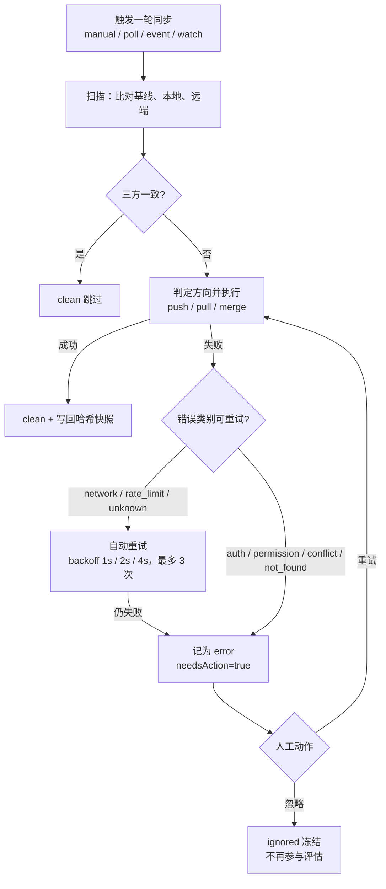
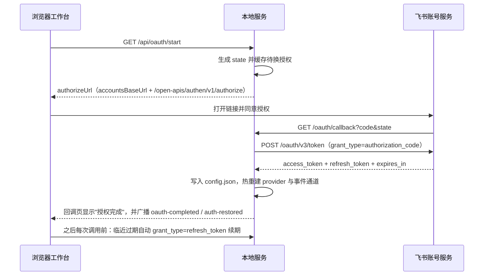

# Feishu Local Sync

本地优先的双向同步工作台：把一个本地 Markdown 目录与一个飞书/Lark 云盘文件夹持续对齐，并在浏览器里完成凭证配置、异常裁决、任务观察与历史回溯。

## 1. 项目简介

服务常驻本机，监听本地文件与飞书远端事件，按**三方合并**（基线 / 本地 / 远端）决定推送、拉取、合并或暂停冲突；每个绑定目录同时是一个 Git 仓库，历史与回滚都走 git，不另建数据库。

- **适用**：本地是主战场的笔记/文档库（Obsidian、静态站点内容、团队 Markdown 规范），需要 git 历史、可回滚、异常时人工裁决而不是机器猜；
- **不适用**：飞书知识库（wiki）节点同步（`remoteType=wiki` 会被明确拒绝，需要独立的节点映射策略）；复杂富文本、多维表格、画板等无法安全映射的结构（会整篇更新或报错，不会静默伪造块 ID）；多用户权限/协作治理（本工具只有一个操作者视角）；生产级多人共享服务（服务只监听本机，凭证明文存本地）。

## 2. 核心特性

| 能力 | 说明 |
| --- | --- |
| 三方合并 | 保存本地/远端/共同基线三份内容，`decideSync` 判定 push / pull / merge / conflict；冲突永不覆盖任一侧 |
| git 基线与历史 | 每轮结束把"已达一致"的文件提交为基线；单文档时间线 diff 与按 commit 回滚 |
| 异常工作台 | 双边冲突 / 远端缺失 / 本地缺失 / 已忽略 四组集中处理，含同名碰撞的三动作裁决 |
| 任务中心 | 进行中（含每轮的「整轮同步」任务）、失败待处理（人工队列，重试或忽略即离开）、最近完成 |
| 触发方式 | 飞书事件长连接 + chokidar 文件监听 + 定时轮询兜底，四类触发共用一条串行队列 |
| 增量同步 | `watch` / `event` 轮次只处理变更路径与变更 token，远端清单走 TTL 缓存 + 单点取文档（见第 9 节） |
| 凭证 | 用户 Token / 应用凭证 / lark-cli 三模式，OAuth 授权码 + refresh 自动续期，热重建 provider |
| 前端 | React + Vite 单页，零依赖 CSS 设计令牌，宽屏流式布局，深浅一致的状态色 |

## 3. 同步语义



两条不变量：

1. **失败不会自动复活。** 条目一旦停在 `error`，后续轮次不会重新评估它——除非本地内容相对 `binding.localContentHash` 真的变了（你改了这个文件），或者你在任务中心点了「重试」/「忽略」。同一轮内一个条目最多尝试一次，失败记录按 entryId 去重，只留一条等人工处理，本轮不再选取。
2. **每一轮都是一个可见任务。** 无论是手动、轮询、监听还是事件，都会写一条 `operation: "sync-round"` 的轮次任务（`runtime.ts` 的 `queueRound`），带上本轮 `summary`（scanned/pushed/pulled/merged/conflicts/failed/skipped）。服务重启时遗留的 `queued` / `running` 记录会被置为 `cancelled` 并标注"服务重启，任务中断"，不会留下假装在跑的僵尸任务。

四类触发（`TRIGGER_LABELS`）：`manual` 手动、`poll` 轮询、`watch` 本地监听、`event` 飞书事件。前两者始终全量扫描，后两者走增量（第 9 节）。

## 4. 一对一匹配模型

**身份契约（B1）**：一条绑定的身份是 `relativePath ⟷ remoteToken` 这一对，**文档标题只是首次配对的发现启发式，不是身份**。标题由文件名推导（`remoteTitle(p)` = 取 basename 去掉 `.md` 后走 `sanitizeSegment`），文件名也由标题推导（`filenameFromTitle(t)` = `sanitizeSegment(t)` 再补 `.md`），两个方向幂等：改了远端标题不会改绑，改了本地文件名会被识别为重命名。（两个函数都在 `packages/core/src/pathsafe.ts`）

四种场景：

| 本地 | 远端 | 行为 |
| --- | --- | --- |
| 有 | 无 | 两步创建并绑定：先建文档拿到 token，再整篇覆盖正文（真实 OpenAPI 的建文档接口不带正文，见 `openapi.ts` 的 `createDocument`） |
| 无 | 有 | `importRemoteDocument` 导入本地；推导出的路径若被他人占用，用 `dedupeSegment` 加 `-<token 前 6 位>` 后缀 |
| 有 | 有 | 已绑定 → `decideSync` 三方判定；**未绑定 → `pairUnboundRemote`**：内容一致则默判为同一文档，补绑定后置 `pending`（本轮同步随即写下基线，转 `clean`）；内容不一致进冲突。这一步专门补"两边都有但从没配过对"的静默漏洞 |
| 无 | 无 | 不建记录；空文件夹保持为空 |

**文件名清洗（`packages/core/src/pathsafe.ts`）**，远端标题落到本地路径时按顺序执行：

| 规则 | 实现 |
| --- | --- |
| Unicode 规范化 | 先 `normalize("NFC")`，避免 macOS 分解式文件名 |
| 非法字符 | 反斜杠、正斜杠、冒号、星号、问号、双引号、尖括号、竖线，以及控制字符（`\u0000-\u001F`、`\u007F`）逐个换为 `_` |
| 首尾点与空格 | 先剥首尾 `.` 和空格，再压缩连续分隔符（否则 `name.  ` 会残留成 `name._`） |
| 空结果兜底 | 清洗后为空 → `Untitled` |
| Windows 保留名 | `con`/`prn`/`aux`/`nul`/`com0-9`/`lpt0-9` 前置 `_` |
| 长度 | 单段 ≤ 200 UTF-8 字节（截断时保留扩展名），整条相对路径 ≤ 1000 字节 |
| 越权路径 | 拒绝 `.`、`..`、绝对路径（`isSafeRelativePath`） |
| 同名碰撞 | 追加 `-<token 前 6 位>` 确定性后缀，并把清洗后的名字写进 `binding.remoteName` |

> **绝不自动删除远端文档。** 本地文件删了只会把条目记为 `local-missing`；真正删除远端对象必须走 `POST /api/entries/:id/delete-remote` 并显式带 `confirmed: true`。
>
> **同名碰撞的三个动作**（异常工作台）：①「重命名本地文件后重新检测」（推荐，远端标题由文件名推导）；②「采用该远端文档」（改绑到当前条目，原条目下一轮按自己的文件名重建，不丢内容）；③「忽略该条目」。同步不猜归属，也不会自动删任何一侧。

## 5. 快速开始

要求：Node.js **>= 20**（`engines`），pnpm **10.32.1**（`packageManager`，可用 `corepack enable` 启用）。存储层用纯 JS 的 `isomorphic-git` + JSON 文件，安装依赖不编译原生模块。

```bash
pnpm install
pnpm build                       # core → storage → feishu → web → server
pnpm --filter @feishu-sync/server dev      # 开发模式（tsx watch）
# 或跑构建产物：
node packages/server/dist/index.js
```

打开 <http://127.0.0.1:8787>（默认只监听 `127.0.0.1:8787`，`HOST`/`PORT` 可改）。在「仪表盘 → 添加目录」里填本地目录与飞书云盘文件夹 token：本地路径必须是**绝对路径且真实存在**，否则 API 返回 400。同一目录重复绑定不会新建记录，会复用既有的根并回 `{"reused": true}`（一个目录只有一个根）。

命令行等价：

```bash
curl -X POST http://127.0.0.1:8787/api/roots \
  -H 'content-type: application/json' \
  -d '{"localPath":"/absolute/path/to/docs","remoteToken":"<folder-token>","remoteType":"folder","pollIntervalMs":15000}'
```

## 6. 凭证配置（一次配置长期复用）

三种认证模式，凭证与偏好统一存在一个本地配置文件里：

| 模式 | 填什么 | 令牌来源 | 自动续期 | 适合 |
| --- | --- | --- | --- | --- |
| `user` | App ID + App Secret + 走 OAuth 授权码拿 user token | `POST /oauth/v3/token` | ✅ refresh token 轮换后续期 | 个人文档库（推荐） |
| `tenant` | App ID + App Secret | `tenant_access_token` | ✅ 由 provider 刷新 | 应用自有文件夹 |
| `cli` | `LARK_CLI_BIN` 可执行文件路径 | 复用本地 lark-cli 登录态 | 取决于 CLI | 已在用 lark-cli 的机器 |

OAuth 授权码流程（默认 scope `offline_access`）：



两项前置条件，缺一不可：

1. 在开发者后台把**重定向 URL**登记为 `http://127.0.0.1:<端口>/oauth/callback`（端口按实际填写；走隧道时用 `FEISHU_OAUTH_REDIRECT_URI` 覆盖）；
2. 给应用开通 **`offline_access`** 权限，否则换不到 refresh token，access token 约 2 小时后失效。授权完成页会明确告诉你有没有拿到 refresh token。

拿不到回调时（服务在另一台机器/容器里）用**手工粘贴授权码**兜底：`POST /api/oauth/code`（设置页有对应输入框），效果与回调一致。

换取失败时按错误码给出中文原因（`AUTHORIZATION_CODE_ERROR_LABELS`）：

| 错误码 | 含义 |
| --- | --- |
| 20002 | App Secret 不正确 |
| 20003 / 20004 / 20065 | 授权码无效 / 已过期 / 已被使用，需重新发起授权 |
| 20005 | `grant_type` 不受支持 |
| 20010 | 当前用户不在应用可用范围内 |
| 20049 | 应用要求 PKCE，请改手工粘贴 refresh token |
| 20071 | 回调地址与登记的重定向 URL 不一致 |

回调里带 `error` 参数时另有 `access_denied`（你取消了授权）、`invalid_scope`（未开通 `offline_access` 等权限）、`server_error`、`temporarily_unavailable` 四种中文提示。

配置文件与优先级：

- 路径默认 `~/.feishu-sync-docs/config.json`，可用 `SYNC_CONFIG_PATH` 改；写盘是 tmp + rename 原子替换并 `chmod 0600`。凭证以明文保存在该文件中（本地优先设计的取舍），所有 API 只回显脱敏形式（token 前 6 后 4），完整凭证不进浏览器也不写日志；
- 优先级：**已保存的配置 > 环境变量**。环境变量 `FEISHU_ACCESS_TOKEN`、`FEISHU_APP_ID`、`FEISHU_APP_SECRET`、`FEISHU_REFRESH_TOKEN`、`LARK_CLI_BIN`（旧名 `LARK_CLI_PATH`）只在没有保存值时兜底；
- 设置页里**令牌和 App Secret 留空即不提交**（前端把空串置为 `undefined`），所以保存其他字段不会顺手清空已存凭证；
- 其他运行时变量：`HOST`、`PORT`（默认 `127.0.0.1:8787`）、`FEISHU_BASE_URL`（默认 `https://open.feishu.cn`，海外 Lark 域名会自动推导对应的 `accounts.larksuite.com`）、`FEISHU_PROVIDER`、`LARK_CLI_API_VERSION`、`SYNC_LOG_LEVEL`（优先于设置页保存的日志级别）。

凭证失效时同步自动暂停：徽章变红、WS 广播 `auth-invalid`，设置页按认证方式给出深链修复指引；重新授权或粘贴新 Token 后自动重测并广播 `auth-restored` 恢复。

## 7. 通知

默认**完全静默**：`notificationChannel` 默认 `"none"`，`DEFAULT_NOTIFICATIONS` 三类（冲突提醒 / 同步失败提醒 / 凭证异常提醒）默认全为 `false`。通知是双重门控：渠道为 `none` 一律不发，渠道开启时还要看该类别开关。

投递走 `NotificationSink` 端口（`packages/server/src/notify.ts`）：

- `NoopSink`：默认实现，测试与未配置时的行为；
- `LogSink`：生产 `buildServer` 实际注册的实现，把通知写进服务端日志；
- `FeishuBotSink`（`notify-feishu-bot.ts`）：**只有骨架，尚未注册**，`notify()` 直接抛"placeholder"。接通群机器人还差四步：① 从配置读 webhook 地址；② 按飞书规范做 HMAC-SHA256 签名；③ `POST` `text` 消息；④ 在 `buildServer` 里按渠道选择注册它。设置页把该渠道显示为「飞书机器人（即将支持）」，不虚报。

四处调用点：冲突产生、条目耗尽自动重试、凭证失效、凭证恢复。诚实说明两点：**浏览器弹窗已随 `App.tsx` 移除**（选 `browser` 渠道现在也只落到服务端日志，不再申请通知权限）；无论渠道如何，`/api/events` 的 WS 广播始终发送，工作台内的徽章和任务列表不受通知配置影响。

## 8. 目录与数据布局

```text
<localPath>/
├── .git/                     # 基线与历史（isomorphic-git），永不删除
└── .feishu-sync/             # 同步元数据，自动写进 .gitignore
    ├── bindings.json         # relativePath ⟷ remoteToken 绑定（含 localContentHash / remoteName / status）
    ├── folders.json          # 目录级映射
    ├── assets.json           # 资源（图片）绑定
    ├── operations.json       # 任务与历史，环形缓冲，最多保留 1000 条
    ├── state.json            # { rootId, localPath, initialized }：元数据属于目录，不属于某条记录
    ├── conflicts/            # 冲突记录（base / local / remote 三份）
    ├── blocks/<entryId>.json # 块 ID 映射（块级补丁用）
    └── backup-<时间戳>/       # 接管或重建前的旧元数据备份
```

规则：

- **一个目录一个根**：绑定前按 realpath 查重，命中则复用既有根（响应 `{"reused": true}`），避免两条记录共用一份 `.feishu-sync` 互相覆盖；
- **孤儿元数据三选一**：目录里有 `.feishu-sync` 但它的 `state.json` 指向已删除的根时，表单会让你选「接管」（改写 `rootId`，保留历史与 git 基线，默认）、「重新绑定」（整体移入 `backup-<时间戳>/` 后从零开始）或「取消」；
- `.gitignore` 由 `initRoot` 自动追加 `.feishu-sync/`，曾被提交过的元数据会被取消跟踪（历史里仍在，工作区不再受它干扰）；
- **删除绑定只备份**：`DELETE /api/roots/:id` 只把元数据移进 `backup-*` 并移除记录，`.git/` 和你的文件永不被它碰。

## 9. 性能与增量同步

`manual` / `poll` 永远是全量轮：整树扫描 + 一次 `listTree` + 每个已绑定文档一次 `getDocument`（云盘清单不含正文，只能逐篇比对哈希）。`event` / `watch` 是增量轮，五个优化点：

| 编号 | 优化 | 位置 |
| --- | --- | --- |
| E1 | 本地整树 walk 换成 `local.scan({ onlyPaths })`，只 stat + 读变更文件（含变更 token 对应的本地半边） | `core/src/local.ts` |
| E2 | 远端清单不全量重取：`probeScopedRemoteTree` 用 TTL 缓存（`SyncEngine.REMOTE_TREE_TTL_MS = 60s`）+ 对变更 token 单点 `getDocument` | `core/src/sync.ts` |
| E3 | 复用本轮 `localByPath` 快照，不在每个条目上重复读盘 | `core/src/sync.ts` |
| E4 | 轮末 `commitBaseline(..., onlyPaths, expectedHashes)` 缩小 `statusMatrix` 范围，并把本轮飞行中又被改动的路径排除出提交 | `storage/src/git.ts` |
| E5 | 有疑就降级：缓存为空/过期，或变更 token 单点取不到（404，可能上游删了整个文件夹）时，本轮回退一次 `refreshRemoteTree` 全量列举，并留下一条轮次告警（"远端对象 X 无法单点获取，本轮已回退为全量列举"）——正确性优先于省调用 | `core/src/sync.ts` |

实测对照（**同一 fixture、同一台机器、内存 FakeRemote 计数，非真实网络**；Node v20.20.2，仓库位于 `/tmp`，1000 个 Markdown 文件分布在 10 个子目录；"优化前"通过临时禁用 `core/src/sync.ts` 的 `incremental` 判定取得，测毕已还原）：

| 轮次 | 远端 API 调用（优化前 → 后） | 本地 stat/读取（优化前 → 后） | 轮次耗时（优化前 → 后） |
| --- | --- | --- | --- |
| `manual` 全量（无变更） | 1001 → 1001（设计不变：全量必须逐篇比对） | 1000 文件 → 1000 文件 | 19.1s → 19.3s |
| `watch` 单个文件保存 | 1003 → **3**（getDocument 2 + applyPatch 1） | 1000 → **1** | 22.0s → **5.3s** |
| `event` 单个远端文档编辑 | 1002 → **2**（getDocument 2） | 1000 → **1**（+1 次写入） | 18.5s → **5.3s** |

结论与诚实的边界：远端调用量从 O(文档数) 降到 O(变更数)，约 330–500 倍；本地扫描同理。但**增量轮并没有降到毫秒级**：残余的 ~5.3s 几乎全花在轮末基线提交上——`commitBaseline` 会把本轮所有 `clean` 条目（这里就是 1000 条）逐个 `git.add` 强制重哈希（这是为了防止 mtime 缓存误判吞掉飞行中的编辑）。单独测量：只传 1 条路径的 `commitBaseline` 78ms，全仓无变更时 163ms。也就是说本地 git 侧仍是 O(N)，要再降需要把强制暂存也收窄到真正变化的路径上（尚未做）。真实网络的往返延迟与限流不在此表内，不要把这张表当线上吞吐。

## 10. Web API 一览

45 条 HTTP 路由 + 1 条 WebSocket。服务只监听本机，且未做认证，**不要把它暴露到公网**。

**设置与凭证**

| 方法 | 路径 | 用途 |
| --- | --- | --- |
| GET | `/api/health` | provider 名与能力、凭证状态、事件通道状态 |
| GET | `/api/settings` | 脱敏凭证 + 事件通道状态 |
| PUT | `/api/settings` | 保存凭证，热重建 provider 并立即回测 |
| POST | `/api/settings/test-connection` | 联通测试（返回身份与延迟） |
| GET | `/api/app-config` | 全局偏好 + `config.json` 路径 |
| PUT | `/api/app-config` | 改默认轮询间隔、日志级别、通知渠道与开关 |
| GET | `/api/api-stats` | 本进程以来的远端调用统计（按方法，含失败与限流计数） |
| GET | `/api/oauth/start` | 生成授权 URL 与 `state` |
| GET | `/oauth/callback` | 飞书回调（返回 HTML，结果经 WS 广播） |
| POST | `/api/oauth/code` | 手工粘贴授权码换取令牌 |

**根目录**

| 方法 | 路径 | 用途 |
| --- | --- | --- |
| GET | `/api/roots` | 列出绑定 |
| POST | `/api/roots` | 新增/复用绑定（`localPath`、`remoteToken`、`remoteType`、`pollIntervalMs ≥ 1000`、`mode`、`exclude`、`metadataAction: adopt\|reset`） |
| GET | `/api/roots/validate-token` | 绑定前轻校验云盘 token |
| GET | `/api/roots/validate-path` | 探测目录现状：是否存在、是否 git 仓库、有无 `.feishu-sync`、是否被别的根占用（`orphanMeta` / `metaIgnored` / `boundRootId`） |
| PATCH | `/api/roots/:id` | 启停、轮询间隔、同步模式、排除规则热生效 |
| DELETE | `/api/roots/:id` | 解绑（元数据移入 `backup-*`，不动 `.git` 与文件） |
| POST | `/api/roots/:id/scan` | 只检测不写入 |
| POST | `/api/roots/:id/sync` | 立即整轮（body 可带 `trigger`） |
| POST | `/api/roots/:id/sync-missing` | 单边缺失批量重同步 |
| GET | `/api/roots/:id/tree` | 本地树 + 每条目状态 |
| GET | `/api/roots/:id/stats` | 状态计数 |
| GET | `/api/roots/:id/file?path=` | 本地文件代理（严格防穿越，越界 403） |
| GET | `/api/roots/:id/history?path=&limit=` | 单文档 git 历史 |
| GET | `/api/roots/:id/folders` | 目录级映射 |
| POST | `/api/roots/:id/folders/rebind` | 手动改绑某个目录的远端 token |
| POST | `/api/roots/:id/pair` | 手动配对 `relativePath` ⟷ `remoteToken` |

**条目、冲突、任务、维护**

| 方法 | 路径 | 用途 |
| --- | --- | --- |
| GET | `/api/entries/:id/content` | 读本地正文 |
| POST | `/api/entries/:id/sync` | 单条立即同步 |
| POST | `/api/entries/:id/ignore` | 忽略 / 恢复（body `{ignored}`） |
| POST | `/api/entries/batch` | 批量 `retry` / `ignore` / `unignore` |
| POST | `/api/entries/:id/restore-base` | 恢复到基线版本 |
| GET | `/api/entries/:id/diff?against=baseline` | 与基线/指定版本比较 |
| POST | `/api/entries/:id/rollback` | 回滚到指定 `commit` |
| POST | `/api/entries/:id/delete-remote` | 删除远端文档（**必须** `confirmed: true`） |
| GET | `/api/assets/:token` | 远端资源代理，只接受已登记的资源 token（文档 token 拒绝） |
| GET | `/api/conflicts?status=open\|resolved\|aborted\|all` | 冲突列表（含 `relativePath`） |
| GET | `/api/conflicts/:id` | 冲突详情（base / local / remote 三份） |
| POST | `/api/conflicts/:id/resolve` | `local` / `remote` / `merged`（需 `mergedContent`） / `abort`；同名碰撞的三个动作也走这里 |
| GET | `/api/operations?rootId=&status=&trigger=&errorCategory=&limit=&cursor=` | 历史查询（含游标） |
| GET | `/api/tasks?status=active\|failed\|succeeded\|cancelled\|all&rootId=&limit=&cursor=` | 任务中心分组视图（`failed` = 待人工处理队列） |
| POST | `/api/tasks/:id/retry` | 重试并让条目离开待处理队列 |
| POST | `/api/tasks/:id/cancel` | 取消排队/运行中的任务 |
| POST | `/api/tasks/batch-retry` | 批量重试（body `{operationIds}`） |
| POST | `/api/tasks/clear-completed` | 清空终态记录（body 可选 `{statuses}`） |
| POST | `/api/maintenance/prune` | 保留策略清理（`keepOperations` / `keepOperationHours` / `resolvedConflictDays`） |
| GET | `/api/events` | WebSocket 长连接（在延迟注册的子插件里用 `route({ wsHandler })` 声明，直接 HTTP 访问返回 426） |

WS 事件类型：`connected`、`sync-started`、`sync`、`scan`、`operation-queued`、`operation-started`、`operation-completed`、`operation-failed`、`operation-retrying`、`operation-cancelled`、`conflict-resolved`、`conflict-aborted`、`auth-invalid`、`auth-restored`、`oauth-completed`、`oauth-failed`、`settings-updated`、`root-updated`、`maintenance-pruned`、`rate-limited`、`error`。

## 11. 故障排查

| 症状 | 定位 | 动作 |
| --- | --- | --- |
| 提示"飞书目标文件夹里已有同名文档" | 远端标题清洗后与另一条目重名（第 4 节） | 三选一：重命名本地文件后点「已重命名，重新检测」／「采用该远端文档」／「忽略该条目」 |
| 徽章显示凭证失效（`invalid`） | token 过期、Secret 错、缺 `offline_access` 所以没续期 | 去授权（`/api/oauth/start`）或重贴 token；若授权完成页说"未拿到刷新令牌"，先在开发者后台开通 `offline_access` 再重新授权 |
| 事件通道一直「未配置」/「连接失败」 | 依次检查：① 未订阅 `drive.file.*`；② 应用版本未发布；③ 云文档权限未开通；④ 服务器网络受限 | 按设置页「查看配置指引」四步补齐；未配置应用凭证或 `cli` 模式下保持 `disabled` 属正常，监听与轮询仍在工作 |
| 大目录第一轮很慢 | 首轮必然全量：每篇文档一次 `getDocument` | 等它跑完；之后 `watch`/`event` 轮只处理变更（第 9 节） |
| 任务中心「失败待处理」里的条目不动、后续轮次也不重试 | 这是设计（不变量 1），失败需要人工裁决 | 点「重试」；或「忽略」让它冻结；改了本地内容也会自动重新入场 |
| 历史页显示"服务重启，任务中断" | 重启时遗留的 `queued`/`running` 被批量置为 `cancelled` | 无需处理，直接「重试」需要的那几条 |
| 设置页调用统计里 `rateLimited` 在涨 | 触发飞书限流 | 拉长轮询间隔；自动重试会按 1s/2s/4s 退避 |
| `.feishu-sync` 出现在 git 提交里 | 早期绑定过，未取消跟踪 | 重新绑定一次会自动补 `.gitignore` 并取消跟踪 |
| 分支是 `master` 或空仓库、没有 `main` 基线 | 基线分支按仓库现状回退到 `HEAD` | 以首次同步的提交为基准，不需要手工建分支 |
| 页面样式散乱 / 图标丢失 | 浏览器加载的是旧的 hash bundle | 确认 `pnpm build` 重跑了 web，硬刷新 |

状态与类别的中文词表在 `packages/web/src/api.ts` 单一定义：`ENTRY_STATUS_LABELS`、`ERROR_CATEGORY_LABELS`、`OPERATION_STATUS_LABELS`、`DIRECTION_LABELS`、`TRIGGER_LABELS`、`SYNC_MODE_LABELS`、`EVENT_CHANNEL_LABELS`、`NOTIFICATION_LABELS`。

## 12. 开发指南

**包结构与依赖方向**（单向，核心不依赖飞书 SDK）：

```text
        core（模型 / 哈希 / 三方合并 / pathsafe，零内部依赖）
        ↑                ↑
     storage          feishu          ← 两者都只依赖 core，互不引用
        ↑                ↑
        └───── server ────┘           ← 组装 provider、监听、API、WS
                    ↑
                   web               ← 不引用任何包；`vite build` 产物拷进 `packages/server/public`
```

**构建顺序**：`core → storage → feishu → web（vite 输出到 packages/server/public）→ server（tsc + cp -R public dist/public）`。顶层 `pnpm build` 已按此串好。

> **改 `core` / `storage` / `feishu` 的 `src` 之后，必须先 `pnpm --filter <pkg> build` 再跑下游测试。** 包之间是通过 `dist/*.d.ts` 互相引用的，dist 过期会让测试"假绿"——测试跑的还是旧实现。

**常用命令**：

| 命令 | 说明 |
| --- | --- |
| `pnpm build` | 五包按序构建 |
| `pnpm test` | 全部测试（core/storage/feishu/server 用 `tsx --test`，web 用 `vitest run`） |
| `pnpm typecheck` | 全包 `tsc --noEmit` |
| `pnpm dev` | 等价于 `pnpm --filter @feishu-sync/server dev`（`tsx watch`） |
| `pnpm --filter @feishu-sync/web typecheck` | 只校前端 |
| `pnpm --filter @feishu-sync/core test` | 只跑某个包 |

测试规模：`pnpm test` 共 **285** 个用例（core 47 / storage 16 / feishu 19 / server 125 / web 78）。看单个包的明细：

```bash
pnpm --filter @feishu-sync/server test 2>&1 | grep -E "^# (tests|pass|fail)"
```

**约定**：

- 中文词表只在 `packages/web/src/api.ts` 定义一份。新增状态或类别时要同步六处：`core/src/types.ts` 的联合类型 → `web/src/api.ts` 的 `*_LABELS` → 服务端校验白名单（`app.ts` 里的 `SYNC_TRIGGERS`、`SYNC_MODES` 等）→ 相关组件的分支 → 对应测试 → 本文件第 11 节词表；
- 样式零依赖：只用 `styles.css` 里的设计令牌（`--space-1..12`、`--radius-sm/--radius/--radius-lg/--radius-md/--radius-pill`、`--text-xs..--text-2xl`、`--shadow-1..3`、`--state-*-bg/-fg/-border`、`--ring`/`--ring-width`、`--measure: 78ch`），不引 UI 库；正文与 diff 列用 `--measure` 约束可读宽度，容器本身是流式宽屏，不再设 1600px/860px 硬上限；
- 远端能力扩展优先新增 `RemoteProvider` 实现，不改同步核心；
- **反向验证习惯**：修 bug 时先写一个能稳定复现的用例（跑一次必须红），再修（跑一次必须绿）。本仓库的 watcher / 事件通道 / 令牌轮换这类时序问题，只有复现用例能证明修好了；
- 不要自动删除远端对象，不要在未确认时覆盖任何一侧内容——这条既是产品语义也是评审底线。

产品需求的完整背景与版本演进见 `docs/product-requirements-v2.md` 与 `docs/product-requirements-v3.md`。
