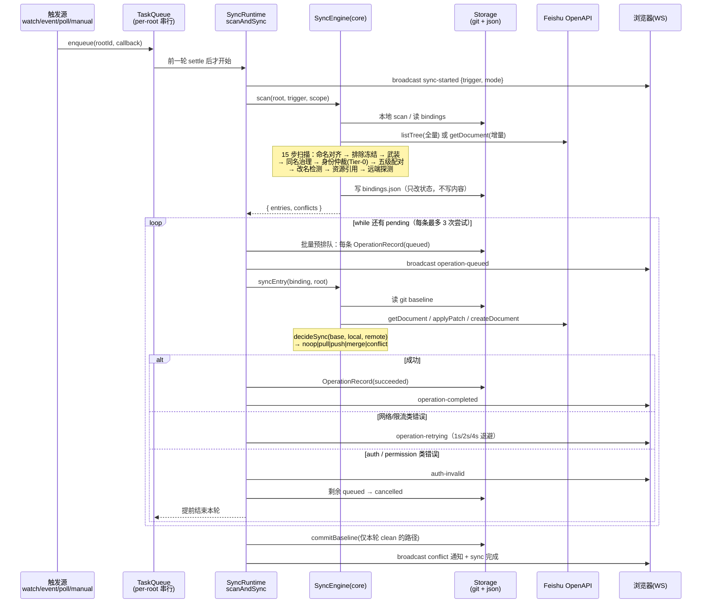

# 01 · 项目全景与快速上手

> 本篇回答三个问题：**这个项目到底在做什么**、**跑起来是什么样**、**一次同步从点击到落盘经历了什么**。读完你就能动手改代码，细节留给 02～07 篇。

---

## 1. 一句话定义

一个**本地优先**的常驻后台服务：把你磁盘上的一个 Markdown 目录，和飞书云盘上的一个文件夹，做成**双向、可回溯、冲突不覆盖**的同步镜像，并附带一个浏览器工作台来管凭证、任务、冲突和历史。

"本地优先"具体指三件事：

1. **文档的唯一真相在本地 Git 仓库里**。服务端不建数据库，内容存在你自己 `git log` 看得见的提交里，元数据存在同目录的 `.feishu-sync/`（已被 `.gitignore` 忽略）。删掉服务、换台机器，只要 clone 这个仓库 + 有 `.feishu-sync/`（甚至没有也能靠信封找回来，见 [04 篇 §2](04-special-mechanisms.md)），映射关系就还在。
2. **飞书只是其中一个镜像端**。远端被删不会连带删本地（只标 `remote-missing`），本地被删不会连带删远端（只标 `local-missing`）。真正的删除必须走带确认字段的显式 API。
3. **崩溃安全**。任何一轮同步被打断，重启后从 git 基线 + 磁盘现状重新推导，不需要"事务日志"也没有中间态残留。

---

## 2. 它能处理哪些真实场景

这些不是设想，是代码里明确写了分支和测试的行为：

| 场景 | 系统的反应 | 依据 |
| --- | --- | --- |
| 你在本地改了 `notes.md` | chokidar 收到 change 事件 → 只对该路径做局部 stat+hash（增量快路径）→ 单条推送 | `runtime.ts` watcher → `scanAndSync(scope)` |
| 同事在飞书编辑了同一篇 | 云盘长连接事件带 token 到达 → 拉取该文档 → canonical hash 比对 → `pull` 写本地 | `eventchannel.ts` + `syncEntry` |
| 你们**同时**改了不同的段落 | `decideSync` 判定 block 不重叠 → 自动 `merge`，双方改动都在 | `merge.ts:52` |
| 你们同时改了**同一个**段落 | 冻结为 conflict，工作台展示 LOCAL/REMOTE/BASE 三栏供你逐 hunk 裁决 | `sync.ts:648` + `IssuesView.tsx` |
| 你把 `a.md` 改名成 `b.md` | 信封里的 token 不变 → 扫描时按 token 精确把 binding 挪到新路径 → **不会**在远端重建文档 | `identity.ts:183`（矩阵 #5） |
| 你把整个目录挪走 | 每个文件的信封独立生效，逐条 re-key，全部保持原 token | `identity.test.ts` 「an entire directory move…」 |
| 你手删了 `.feishu-sync/` 整个元数据目录 | 下一轮扫描从信封按 token 精确重连，**不重复导入、不重复建文档** | `identity.test.ts` 「reconnects purely by frontmatter…」 |
| 远端有人"创建副本"造出一个同名文档 | 同名副本治理：内容一致则软删除 loser；内容不一致则 conflict 留人工 | `rename.ts:101` |
| 远端文档标题带 `/`、`:`、Windows 保留名 | `sanitizeLocalSegment` 净化成合法文件名，并保证标题配对时两侧走同一归一化键 | `names.ts:41` |
| 飞书返回 429 限流 | 读 `Retry-After` 作为退避**下限**（不是固定值），顶栏倒计时徽章 | `errors.ts:28` + `runtime.ts` |
| refresh token 过期 / 被吊销 | 立即中断整轮、取消剩余排队任务、广播 `auth-invalid`、深链到授权引导 | `runtime.ts:705` 附近 |

---

## 3. 十分钟跑通

### 3.1 前置

- **Node ≥ 20**（用到了全局 `fetch`、`node:test` 的 `describe/it`、`structuredClone` 等）。
- **pnpm**。仓库锁定 `pnpm@10.32.1`，最省事的方式：

```bash
corepack enable          # 让 corepack 按 packageManager 字段自动装对版本
cd /path/to/feishu-sync-docs
corepack prepare pnpm@10.32.1 --activate
```

> ⚠️ **真实的坑**：`corepack enable` 往 `/usr/local/bin` 或 `~/.local/bin` 写 shim，如果你之前用 `npm i -g pnpm` 装过一个旧版，PATH 顺序可能让你拿到错的版本，报 `This project is configured to use v10.32.1`。用 `pnpm --version` 和 `which pnpm` 确认。更多环境坑见 [05 篇 §1](05-developer-guide.md)。

- **一个飞书企业自建应用**（如果只是想跑起来看 UI，可以先不配凭证——服务照常起，只是同步会失败并在顶栏告警）。

### 3.2 安装、构建、启动

```bash
pnpm install
pnpm build          # 顺序：core → storage/feishu → web → server
pnpm dev            # = pnpm --filter @feishu-sync/server dev = tsx watch src/index.ts
```

看到 `feishu-sync listening on http://127.0.0.1:8787` 即成功。打开 <http://127.0.0.1:8787>，你会看到工作台（侧边栏：仪表盘 / 任务中心 / 设置，首次进入会弹引导）。

> `pnpm build` 不能省。server 通过 `tsc` 编译产物运行 `dev` 时靠 `tsx` 直读 TS，但 **`@feishu-sync/core` 等 workspace 包是按 `dist/` 的 `types` 字段解析的**——没 build 过 core 就会报 `Cannot find module '@feishu-sync/core'` 或 TS2305「没有导出成员」。改了 core 的导出后如果 server 报找不到符号，第一反应是回去 `pnpm -r build`。

### 3.3 配凭证（四种填法，三个 mode 值）

设置页 →「飞书凭证」。注意**代码里的 `mode` 字段只有 `user | tenant | cli` 三个值**（`credentials.ts:13`），README 说的"四种方式"里的手工 token 和 OAuth 登录都属于 `user` 模式，区别只是有没有 refresh token。

| 填法 | mode | 需要的字段 | 续期行为 |
| --- | --- | --- | --- |
| **OAuth 一键授权**（推荐） | `user` | App ID + App Secret + 点「飞书授权登录」 | 提前 5 分钟自动续期，每次刷新顺延约 7 天 |
| 手工粘贴 user_access_token | `user` | 只填 accessToken | 不续期，过期后报错等你换（非 JWT 的不透明 token 视为永不过期，"用到被拒为止"） |
| 应用凭证 | `tenant` | App ID + App Secret | tenant token 自动刷新 |
| lark-cli | `cli` | 可执行文件路径 | 复用 CLI 登录态 |

**「输入框留空 = 保持已保存值」**：`save()` 里空串和 `undefined` 同义（`credentials.ts:118` 的注释写明了原因——浏览器会把所有 input 一起提交，空串若当"清空"就会把用户已经看不见的 secret 抹掉）。写前端表单时务必遵守这个约定。

OAuth 最容易踩的是回调地址：飞书对 `redirect_uri` 做**逐字符精确匹配**，登记了 `127.0.0.1` 却用 `localhost` 访问（或端口不同）都会报「重定向 URL 有误」。可用 `FEISHU_OAUTH_REDIRECT_URI` 或设置项 `feishu.oauthRedirectUri` 显式覆盖。

### 3.4 建第一个同步根

仪表盘 →「添加目录」，或者直接调 API：

```bash
curl -X POST http://127.0.0.1:8787/api/roots \
  -H 'content-type: application/json' \
  -d '{"localPath":"/absolute/path/to/docs","remoteToken":"<飞书文件夹token>","remoteType":"folder","pollIntervalMs":15000}'
```

约束（都在 `app.ts:158`）：

- `localPath` 必须是**绝对路径且已存在**，否则 400；
- 同一 `localPath` 只允许绑一个 root，重复返回 409；
- `remoteType: "wiki"` 会被明确拒绝（`app.ts` 校验 + `openapi.ts:95` 抛错）。

创建成功的瞬间，服务端依次做四件事（`runtime.ts` 的 `createRoot` 路径）：

1. `gitStorage.initRoot(root)` —— 目录不是 git 仓库就 `git init`（默认分支 `main`），写 `.gitignore`（内容就是 `.feishu-sync/`）并做一次初始提交；
2. `metaStorage.initRootMeta(rootId, localPath)` —— 建 `.feishu-sync/{bindings.json,folders.json,operations.json,assets.json,state.json,blocks/,conflicts/}`；
3. `startRoot(root)` —— 起 chokidar watcher + poll 定时器；
4. **立即排一轮 manual 同步**，所以你不用等 15 秒就能看到结果。

### 3.5 验证确实同步上了

```bash
curl -s http://127.0.0.1:8787/api/roots/<rootId>/stats | head -c 400
head -5 /absolute/path/to/docs/你的某个文件.md      # 应该看到 ---\nfeishu_token: ...\nfeishu_root: ...\n---
git -C /absolute/path/to/docs log --oneline | head  # 应该看到 "sync: manual [trigger=manual]"
```

**看到文件顶部多了 4 行 YAML，就说明身份信封机制在工作了。** 这 4 行永远不会被推到飞书（见 [04 篇 §1](04-special-mechanisms.md)）。

---

## 4. 目录长什么样

```
feishu-sync-docs/
├── package.json                 pnpm workspace 根：build/test/typecheck 四个脚本
├── pnpm-workspace.yaml
├── README.md                    面向**使用者**的说明（特性、凭证配置、同步语义）
├── docs/                        面向**开发者**的本文档系列
└── packages/
    ├── core/      @feishu-sync/core      零依赖的同步内核：类型、哈希、Markdown 解析、
    │                                      三方合并、信封、身份仲裁、扫描/执行引擎
    ├── storage/   @feishu-sync/storage   GitStorage(isomorphic-git) + JsonMetaStorage
    ├── feishu/    @feishu-sync/feishu    OpenAPI provider + lark-cli 适配器 + 错误码分类
    ├── server/    @feishu-sync/server    SyncRuntime 编排 + Fastify HTTP/WS + 凭证 + 事件通道
    └── web/       @feishu-sync/web       React 19 工作台，构建产物拷进 server/public 静态托管
```

一个同步根跑起来后，**你自己的目录**会变成这样：

```
your-docs/
├── .git/                        正文与全部版本历史（真相源）
├── .gitignore                   内容：".feishu-sync/\n"（initRoot 自动创建，已存在则不动）
├── .feishu-sync/                ← 被 gitignore，纯元数据
│   ├── bindings.json            relativePath → EntryBinding（身份/状态/远端 revision 与哈希）
│   ├── folders.json             本地目录 → 远端文件夹 token（避免重启后重复建目录）
│   ├── blocks/<entryId>.json    本地 block ↔ 远端 blockId 映射（块级增量用）
│   ├── operations.json          任务记录环形缓冲（上限 1000 条）
│   ├── conflicts/<id>.json      每个冲突一个文件
│   ├── assets.json              图片路径 → 引用它的 document entryId 列表
│   └── state.json               { initialized, lastSyncCommit, lastSyncAt }
├── notes.md                     顶部带 feishu_token 信封
└── images/logo.png              作为 kind:"asset" 条目参与同步
```

全局配置在 `~/.feishu-sync-docs/`（`SYNC_CONFIG_PATH` 可改）：

```
~/.feishu-sync-docs/
├── config.json     0600 权限，原子写。{ version:1, credentials:{...}, preferences:{...} }
└── roots.json      所有 SyncRoot 列表（JsonMetaStorage 维护，与 config.json 分家）
```

---

## 5. 一次同步的完整生命周期（鸟瞰）

下面这条链是本项目最重要的心智模型。03 篇会把每一步展开成图，这里先建立整体感。



**五个必须记住的不变量**（破坏任何一条都会产生数据丢失或永久抖动）：

1. **扫描阶段绝不写内容**，只写元数据状态。真正读写文件内容只发生在 `syncEntry` 里。
2. **信封只活在磁盘上**。所有 `sha256`、所有发到飞书的 HTTP body、所有 block 映射，操作的对象永远是剥掉信封的 `body`。
3. **已持有 `remoteToken` 的条目永不进入模糊配对**。配对层级里只有 Tier-0（信封精确）和 Tier-1（DB token 精确）是"权威"，路径/标题/内容哈希三级只对**至今未绑定**的文档开放。否则一个远端副本就能偷走一个活绑定。
4. **只对 `clean` 的条目提交基线**。冲突/失败/缺失的条目保留旧基线，否则下一轮会看到 `base === local` 而把远端内容误拉下来覆盖。
5. **同一个 root 的两轮同步绝不交叠**。跨 root 并发、同 root 串行，靠 `TaskQueue` 的一条 Promise 链保证。

---

## 6. 读代码的建议路径

如果你想最快建立"改这里会影响什么"的直觉，按这个顺序读：

1. `packages/core/src/types.ts`（441 行）——**全项目的词汇表**，所有接口和它们的注释都在这里。先读完它，其他文件会好懂一半。
2. `packages/core/src/frontmatter.ts`（217 行）——信封机制的全部细节，文件头注释就是设计文档。
3. `packages/core/src/merge.ts` 的 `decideSync`（L52）——只有 8 行的决策函数，却是整个双向同步的语义核心。
4. `packages/core/src/sync.ts` 的 `scan()`（L77-490）——最长的一段，对照 [03 篇 §3](03-sync-pipeline.md) 逐步读。
5. `packages/server/src/runtime.ts` 的 `scanAndSync()`（L677-768）——编排、排队、重试、基线，串起上面所有东西。
6. `packages/server/src/app.ts`——46 个端点，对照 [06 篇](06-api-and-ui-reference.md) 当索引查。

> 一个实用技巧：`core` 包**零运行时依赖**（`package.json` 的 `dependencies` 是空对象），所以你可以直接 `npx tsx` 跑一段 core 的逻辑做实验，不需要起服务、不需要飞书凭证。[05 篇 §5](05-developer-guide.md) 给了可复制的调试脚本模板。
