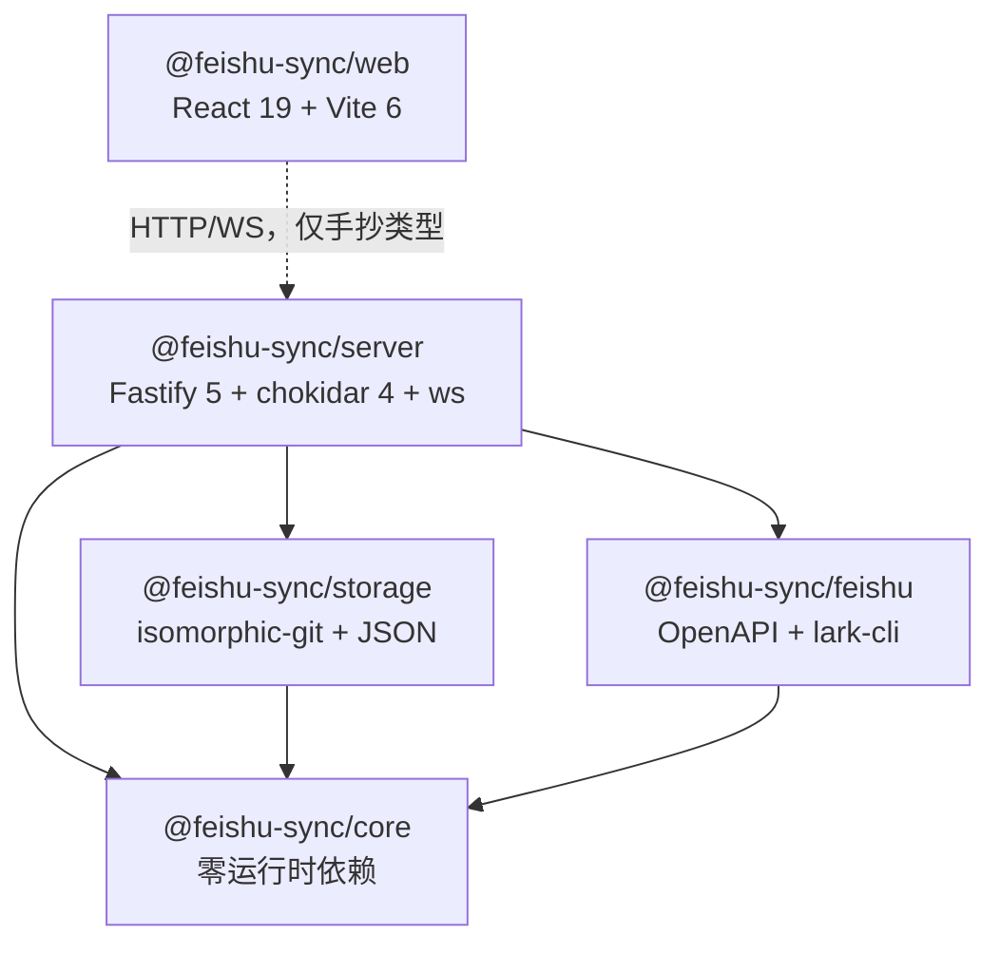
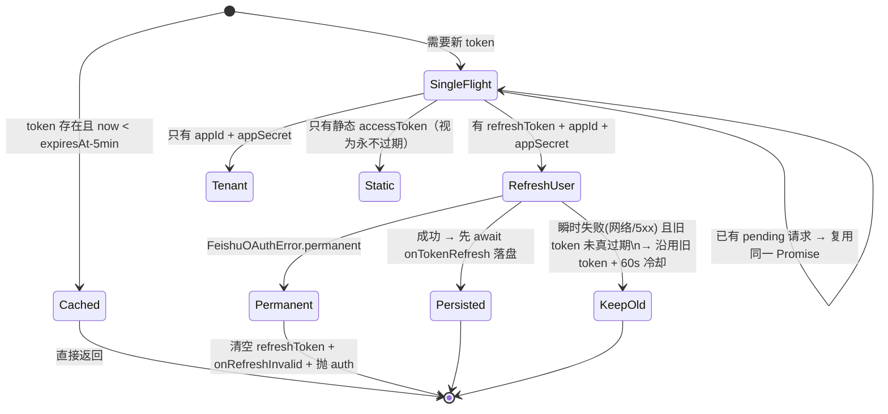

# 02 · 代码结构与组件职责

> 本篇是"这段逻辑在哪个文件"的索引，以及全项目数据结构的完整清单。

---

## 1. 包依赖方向（不可违反）



三条硬规则：

- **`core` 不许引入任何运行时依赖**。它必须能被 `npx tsx` 直接跑起来做实验，也必须能被任何 provider/storage 复用。`frontmatter.ts:25` 的注释专门解释了为什么连 YAML 解析器都不用（会重排键、丢注释、改格式，破坏"逐字节可逆"这个核心不变量）。
- **`core` 不许知道飞书的存在**。远端能力全部通过 `RemoteProvider` 接口注入。要接 Notion/Confluence，实现这个接口就行，`core` 一行不改。
- **`storage` 和 `feishu` 互不依赖**，只在 `server/src/app.ts` 里被组装到一起。

`web` 严格说不是"依赖"`server`，它只调 HTTP；但**前端类型是手抄的一份**（`api.ts` 里自己声明了 `SyncRoot`/`EntryBinding` 等），这是已知风险，见 [07 篇 §4](07-known-issues.md)。

---

## 2. `packages/core` —— 同步内核（14 个文件，约 3400 行）

| 文件 | 行数 | 职责 | 关键导出 |
| --- | --- | --- | --- |
| `types.ts` | 441 | **全项目词汇表**：所有接口、状态枚举、`LocalProvider`/`RemoteProvider`/`GitStorage`/`MetaStorage` 四大接口契约 | 见本篇 §5 |
| `sync.ts` | 956 | `SyncEngine`：`scan()` 15 步扫描、`syncEntry()` 单条执行、创建/推送/拉取/合并分支、`applyResolvedContent` | `SyncEngine` |
| `identity.ts` | 270 | **Tier-0 身份层**：`index()` 建 token 索引、`reconcile()` 执行六格仲裁矩阵 + 铁律 R1/R2、`stamp()`、`raiseIdentityConflict()` | `IdentityResolver`, `TokenIndex` |
| `frontmatter.ts` | 217 | 信封的读写。`splitDocument`/`writeSyncDocument` 互为精确逆运算 | `splitDocument`, `stripEnvelope`, `writeSyncDocument`, `composeSyncDocument`, `withBody`, `readSyncDocument` |
| `importer.ts` | 239 | `RemoteImporter`：远端文档导入落盘、`prepareAssets` 图片上传映射、`buildLinkMaps` 链接映射、`hydrateChangedRemoteAssets` 远端图片更新回灌、`saveBlockMapping` | `RemoteImporter` |
| `markdown.ts` | 231 | Markdown ↔ 规范化 block。`parseMarkdown` 切块 + 分类 + 稳定 id；内部链接 / 图片引用的双向改写（本地路径 ⇄ 飞书 `<cite>`/``） | `parseMarkdown`, `joinBlocks`, `rewriteInternalLinks`, `restoreInternalLinks`, `rewriteAssetReferences`, `restoreAssetReferences` |
| `rename.ts` | 187 | `RenameDetector`：`ensureRemoteTitle` 标题钉回、`detectRename` 改名/移动检测（先按 token 精确、再按内容哈希）、`governDuplicates` 同名副本治理、`findDuplicateLocalDocument` 重复导入防护 | `RenameDetector` |
| `merge.ts` | 156 | 三方合并决策与块补丁规划。`decideSync` 是纯函数；`buildBlockPatch` 决定走块级还是整篇 overwrite | `decideSync`, `buildBlockPatch` |
| `local.ts` | 148 | `FilesystemProvider implements LocalProvider`：`scan` 全量遍历、`scanEntries` 增量 stat、`safePath` 路径逃逸拒绝、`atomicWrite` 临时文件 + rename | `FilesystemProvider` |
| `remote_tree.ts` | 140 | `RemoteTreeCache`：60 秒 TTL 的远端树快照 + single-flight、`buildScoped` 增量最小树、`buildPathMaps` token→本地路径投影（含跨标题碰撞消歧） | `RemoteTreeCache` |
| `name_align.ts` | 128 | `LocalNameAligner`：首次绑定时把本地文件名改成文档自己的 H1（对齐"文件名==H1==远端名"），并级联改写指向它的链接；大小写改名走临时文件中转 | `LocalNameAligner` |
| `sync_paths.ts` | 82 | 无状态路径工具：`resolveRelativePath`、`isRemoteNotFound`、`documentTitle`、`mimeType`、`remoteRelativePath`（沿 parent 上溯构造本地路径，防环、防逃逸）、`ensureMarkdownPath`、`uniqueLocalPath`（`-2/-3` 后缀） | 同名函数 |
| `names.ts` | 78 | 文件名净化与比较归一化：`sanitizeLocalSegment`（Windows 保留名/非法字符/HTML 实体/240 字节截断）、`normalizeForMatch`（NFC+trim）、`titleToLocalSegmentKey`（sanitize→normalize 的一致比较键） | 同名函数 |
| `glob.ts` | 51 | 极简 gitignore 风格匹配（`*`/`**`/`?`），给 `root.exclude` 用 | `matchesAnyGlob` |
| `hash.ts` | 9 | `sha256` 与 `normalizeText`（CRLF→LF） | `sha256`, `normalizeText` |
| `sync_services.ts` | 14 | 依赖容器接口：把 local/remote/metaStorage/gitStorage/notifier 打包传给 core 的各个协作者 | `SyncServices` |
| `index.ts` | 20 | 统一 re-export | — |

### `SyncEngine` 的五个协作者

`sync.ts` 刻意不做成一坨，而是组合了五个类，都通过 `SyncServices` 拿到同一套存储：

```ts
// sync.ts 构造函数（简化）
class SyncEngine {
  private readonly identity   = new IdentityResolver(services);
  private readonly importer   = new RemoteImporter(services);
  private readonly rename     = new RenameDetector(services);
  private readonly nameAlign  = new LocalNameAligner(services);
  private readonly tree       = new RemoteTreeCache(services);
}
```

`sync.ts` 里那批 `private` 单行方法（`buildLinkMaps`、`importRemoteDocument`、`governRemoteDuplicates`、`detectRename`…，见 L806-936）**全部是一行转发**，真实实现在协作者类里。看到 `this.xxx()` 找不到逻辑时，去对应的协作者文件里找。这样切的目的是：`scan()`/`syncEntry()` 只保留"什么时候做"的编排，"怎么做"分散到可单测的单元。

---

## 3. `packages/storage`（2 个文件，983 行）

### `git.ts` — `GitStorageImpl`（300 行）

用 `isomorphic-git`（**纯 JS，装依赖不编译原生模块**，这是选它而不是 simple-git 的原因）。

| 方法 | 关键点 |
| --- | --- |
| `initRoot` | 已是仓库就直接返回（幂等）；否则 `git.init({defaultBranch:'main'})` + 写 `.gitignore` + 初始提交 `init: feishu-sync repository` |
| `getBaseline` | 读 `refs/heads/main` 的 blob。异常一律返回 `undefined`（表示"该路径在基线里不存在"），三方合并把 `undefined` 当空串 |
| `commitBaseline(rootId, msg, trigger, onlyPaths?)` | 见下面的详解 |
| `getHistory` / `readBlobAt` / `listCommitsForPath` | 支撑工作台的历史时间线和"恢复到基线版本" |
| `parseTrigger` | 从提交信息里的 `[trigger=xxx]` 反解触发源——**提交信息是契约的一部分**，改格式会让 UI 的 trigger 过滤失效 |

`commitBaseline` 的两个易错细节（`git.ts:104-162`）：

1. **`onlyPaths` 是强制 add，不是"过滤 statusMatrix"**。注释解释了原因：等字节数的编辑（改一个字符长度不变）如果 mtime 撞上 index 缓存，`statusMatrix` 的 workdir 位可能仍是 0（看起来没变），只有无条件 `git.add` 重新哈希真实内容才不会被漏掉。
2. **无变更不产生空提交**：staged 后 `head === stage` 就直接返回当前 HEAD 的 oid。否则每轮都会刷一堆空提交。

### `meta.ts` — `JsonMetaStorage`（685 行）

无数据库，全部 JSON 文件。两层布局：

- **全局**（`~/.feishu-sync-docs/`）：`roots.json`（所有 SyncRoot）、`settings.json`。
- **每 root**（`<localPath>/.feishu-sync/`）：`bindings.json`、`folders.json`、`operations.json`、`assets.json`、`state.json`、`blocks/<entryId>.json`、`conflicts/<id>.json`。

值得注意的实现点：

- **`bindingsCache`（L23-28）**：每轮同步会为了 link 映射、资源准备、逐条探测反复读整张 bindings 表，在 500 文档的 root 上是 O(N²) 次整文件读。这里加了读穿缓存，**每次写 binding 立即 delete 缓存项**，保证与磁盘一致。改动这块时务必保持"写即失效"。
- **`operations.json` 是环形缓冲**：`MAX_OPERATIONS = 1000`（L10），超出从头裁剪。
- **`findBindingById(entryId)` 跨所有 metaDir 线性扫**（L174）——它没有全局索引，是性能上的已知点。
- **`recoverStaleOperations(rootId)`**：启动时把上次进程留下的 `queued`/`running` 记录改成 `cancelled`。因为任务队列在内存里，这些记录永远不会再完成，不清理就变成任务中心的幽灵。
- **`pruneHistory` 返回的 `snapshots` 恒为 0**（L552）——快照表已被 git 基线取代，字段留着只为兼容前端类型。UI 文案里还提"孤儿快照"，是个小瑕疵。
- **`resolveConflict` 无 `kind` 感知**（L414）：它只是把 `status`/`resolution`/`mergedContent` 写进冲突文件，不看 `kind`。这个"看不见 kind"的性质正是 [07 篇 §1](07-known-issues.md) 那个真实缺陷的根因。

---

## 4. `packages/feishu`（5 个文件，约 700 行）

| 文件 | 行数 | 职责 |
| --- | --- | --- |
| `openapi.ts` | 459 | `FeishuOpenApiProvider implements RemoteProvider`。全部飞书 HTTP 调用 + token 生命周期 |
| `errors.ts` | 111 | 错误分类：`FeishuApiError`/`FeishuOAuthError`、`classifyFeishuFailure`、`categorizeError`、`parseRetryAfterMs`、`RETRIABLE_ERROR_CATEGORIES` |
| `cli.ts` | 107 | `LarkCliProvider`：`execFile` 调本地 lark-cli，解析 JSON 输出。能力受 CLI 版本限制（`LARK_CLI_API_VERSION=v2` 才支持块级） |
| `ws.ts` | 5 | 薄封装：把 `@larksuiteoapi/node-sdk` 的 `WSClient`/`EventDispatcher`/`Domain` re-export 给 server 用 |
| `index.ts` | 4 | re-export |

### `openapi.ts` 用到的飞书端点（这张表就是"接口契约"）

| 能力 | 方法与路径 | 说明 |
| --- | --- | --- |
| 取正文 | `POST /open-apis/docs_ai/v1/documents/{token}/fetch` | `format:"markdown"` + `extra_param` 必须是 **JSON 字符串**（传对象会被 schema 校验打回，code 9499）+ `export_option.export_block_id` |
| 列目录 | `GET /open-apis/drive/v1/files?folder_token&page_size=200` | 单层分页；`walkDrive` 递归 DFS（**串行**，大目录慢，见 B 系列缺陷） |
| 建文件夹 | `POST /open-apis/drive/v1/files/create_folder` | ⚠️ **返回的 token 在 `data.token`，不在 `data.file.token`**——早期按旧文档解析 `data.file` 导致每次成功创建都抛错重试，于是重复建目录（`openapi.ts:128` 注释） |
| 建文档① | `POST /open-apis/docx/v1/documents` | 带 `title` 建**空**文档 |
| 建文档② | `PUT /open-apis/docs_ai/v1/documents/{token}` | `command:"overwrite"` 灌 Markdown 正文 |
| 块级改 | `PUT /open-apis/docs_ai/v1/documents/{token}` | `command` ∈ `block_insert_after`/`block_replace`/`block_delete`/`overwrite` |
| 改标题 | `PATCH /open-apis/docx/v1/documents/{token}/blocks/{token}` | `update_text_elements`，block_id 就是 document_id（page block） |
| 列块 | `GET /open-apis/docx/v1/documents/{token}/blocks?page_size=500` | `block_type===1` 是 root |
| 传资源 | `POST /open-apis/drive/v1/medias/upload_all` | `parent_type` = `explorer`（普通文件）或 `docx_image`（内联图） |
| 下资源 | `GET /open-apis/drive/v1/medias/{token}/download` | 二进制，不走 envelope 解析 |
| 软删除 | `DELETE /open-apis/drive/v1/files/{token}?type=docx\|folder\|file` | **必须带 type 查询参数** |
| 刷 user token | `POST {accounts}/oauth/v3/token` | 域名是 `accounts.feishu.cn`，**不是** `open.feishu.cn`（`accountsBaseUrl()` 做替换） |
| 取 tenant token | `POST /open-apis/auth/v3/tenant_access_token/internal` | — |

**`createDocument` 为什么要两步**（L137-174）：`docs_ai` 的创建接口会用 Markdown 的首个 H1 推导文档标题，于是两个文件共享同一个一级标题就会建出同名的两个远端文档，直接撞上引擎的同名额守卫。改成"先用 `docx` 建带 title 的空文档 → 再用 `docs_ai` overwrite 灌正文"，标题就是本地文件名的确定函数。

**两处"失败也要返回而不是抛"的防御**（这是踩坑换来的）：

- `createDocument` 里正文写完后 `getDocument` 失败 → 返回一个 content 为空的 **stub**（L157-173）。若在这里抛，调用方重试会**再建一个文档**，云盘里留下孤儿副本；返回 stub 让 binding 能落库，下一轮扫描再刷新真实内容。
- `softDelete` 前 `listNativeBlocks` 整体 try/catch 返回 `{blocks: []}`（L280）——拿不到块映射不是失败理由，退化成整篇 overwrite 而已。

### token 生命周期（`getToken`/`obtainToken`/`refreshUserAccessToken`）



三个关键设计：

1. **single-flight**（`this.tokenRequest`）：并发调用共享同一个刷新 Promise，避免同时打多个 `/oauth/v3/token`——**refresh token 是一次性轮换的**，并发刷新会让后来的请求拿着已失效的旧 token 失败。
2. **先落盘再返回**（L411 `await this.options.onTokenRefresh?.(...)`）：旧的 refresh token 在服务端此刻已经作废，如果进程在"刷新成功 → 写盘"之间崩溃，refresh token 就永久丢了，必须重新授权。这仍是一个无法彻底消除的崩溃窗口（飞书机制固有）。
3. **瞬时失败降级用旧 token + 60s 冷却**（L355）：断网时不要拿"刷新失败"去刷挂调用方，旧 token 往往还在真有效期内；`refreshCooldownUntil` 防止连续调用反复打 token 端点。

`capabilities` 声明是 `{blockPatch:true, revisionGuard:true, assetUpload:true, remoteEvents:false}`（L69）。**`remoteEvents:false` 是诚实的**：provider 本身不提供事件，事件由 server 的 `EventChannelService` 独立走 SDK 长连接拿，所以 `sync.ts` 不能依赖 provider 推送。

### 错误码分类（`errors.ts`）

| 分类 | 判定依据 |
| --- | --- |
| `auth` | envelope code ∈ `{99991661, 99991663, 99991664, 99991668, 99991679}`，或 HTTP 401，或 CLI 消息命中 `/token\|auth\|认证\|登录\|unauthorized\|401/i` |
| `permission` | HTTP 403 或消息命中 `权限\|forbidden\|access denied` |
| `rate_limit` | HTTP 429 或 `too many\|限流` |
| `not_found` | HTTP 404 或 `notexisted\|deleted` |
| `network` | fetch 抛异常（DNS/refused/aborted），`networkError()` 包装 |
| `other` → 折叠成 `unknown` | — |

**`categorizeError(error, entryStatus)` 的第一行是 `if (entryStatus === "conflict") return "conflict"`**（L88）——条目状态**优先于**传输层分类，这样任务中心会把"需要人去裁决"和"网络抖了一下"分开显示，而不是把一个冲突失败标成 unknown 让用户以为重试就好。

**`RETRIABLE_ERROR_CATEGORIES = {network, rate_limit, unknown}`**（L111）。`auth`/`permission` 需要用户动作、`conflict` 需要人决策、`not_found` 本轮无解，**三者都不自动重试**。

---

## 5. `packages/server`（11 个文件，约 2800 行）

| 文件 | 行数 | 职责 |
| --- | --- | --- |
| `runtime.ts` | 1035 | **`SyncRuntime`：整个服务的大脑。**生命周期、per-root 车道、`scanAndSync` 编排、重试退避、回声抑制、commitBaseline、WS 客户端管理与广播、维护定时任务、conflict 解决 |
| `app.ts` | 514 | `buildApp()` 装配 + 46 个 HTTP 端点 + 1 个 WS 端点（`/api/events`）+ `setErrorHandler` + `onClose` |
| `credentials.ts` | 382 | `CredentialStore`：config.json 读写 + env fallback、`mask()` 脱敏、连通测试、OAuth state 与 code 交换 |
| `eventchannel.ts` | 200 | `EventChannelService`：SDK 长连接订阅云盘事件、1.5s 尾部防抖、generation 号丢旧客户端事件、状态机 disabled/connecting/connected/error |
| `appconfig.ts` | 153 | `AppConfigStore`：config.json 的原子读写（tmp + rename、chmod 0600）、偏好默认值与校验、`AUTH_FLAG_KEYS` |
| `apistats.ts` | 105 | 端点调用计数与耗时（设置页「API 统计」） |
| `provider.ts` | 82 | `ProviderRegistry`：按凭证配置构建/热重建 provider |
| `echo_guard.ts` | 52 | `EchoGuard`：两个 `key→过期时间戳` 的 Map，TTL 5s，插入时顺手裁剪过期项 |
| `task_queue.ts` | 41 | `TaskQueue`：per-root Promise 链车道，`enqueue`（fire-and-forget）与 `enqueueResult`（等值但同样吞异常） |
| `notify.ts` | 39 | `Notifier` 接口 + `NoopNotifier`（**通知未开放**） |
| `index.ts` | 18 | 进程入口：`buildApp` → `runtime.start()` → `eventChannel.start()` → `listen` → SIGINT/SIGTERM `shutdown` |

### `runtime.ts` 的内部结构（按功能分区）

| 区块 | 行范围（约） | 内容 |
| --- | --- | --- |
| 构造与配置 | L60-135 | 十个注入参数（local/remote/git/meta/notifier/sleep/logger…），`sleep` 可注入是为了测试里跳过 1s/2s/4s 退避 |
| `start`/`stop` | L140-190 | prepareRemote → 仅对 `enabled` 的 root 做 `initRoot`+`initRootMeta` → `recoverStaleOperations` → `startRoot` → `scheduleMaintenance` |
| 维护 | L190-230 | `pruneHistory`（默认保留 1000 条操作 / 24 小时 / 已解决冲突 30 天，可由 `SYNC_RETENTION_*` 覆盖）、`scheduleMaintenance`（默认 1 小时，`SYNC_MAINTENANCE_INTERVAL_MS`），定时器 `unref()` 所以不会拖住进程退出 |
| 车道与触发 | L230-350 | `enqueue`/`enqueueResult`、watcher 装配、poll 定时器、`syncRoot`/`scanRoot` |
| `resolveConflict` | L354-397 | 冲突裁决（abort 走重新排队；local/remote/merged 走 `applyResolvedContent`），带**过期检测**：远端 revision 或 hash 变了就 409 |
| WS 客户端 | L399-460 | `addClient`/`broadcast`/心跳 |
| 编排 | L640-768 | `syncSingleEntryAndCommit`、`syncSingleEntry`、**`scanAndSync`** |
| 单条执行 | L770-880 | **`syncEntryWithRetry`**：退避、错误分类、auth fail-fast、`rate-limited` 广播 |
| watcher | L880-960 | chokidar 装配 + `watcherIgnore` 谓词 + 回声判定 |
| 辅助 | L960-1035 | `numberFromEnv`、`log`、`isAuthError` 等 |

### `TaskQueue` 为什么这样写（41 行，值得逐行看）

```ts
enqueue(id, callback) {
  const previous = this.queues.get(id) ?? Promise.resolve();
  const next = previous.then(() => callback()).then(() => undefined).catch((error) => {
    this.onError(id, error);          // ← 异常在此被吞掉
  });
  this.queues.set(id, next);
  return next;
}
```

关键在于 **`.catch` 挂在链上而不是调用方**：如果某个 fire-and-forget 任务 reject 了而链上没有 catch，下一个排进这条 lane 的任务就会因为 `previous` 是 rejected Promise 而**永远不执行**——车道被 wedge。`enqueueResult` 同理：把 rejected 的 `result` 返回给调用方（让 API 路由拿到错误并回 500），但**存进 map 的是已经 `.catch` 过的链**。

---

## 6. `packages/web`（26 个文件，约 5000 行）

| 文件 | 行数 | 职责 |
| --- | --- | --- |
| `src/App.tsx` | 614 | 唯一的"路由器"：**没有路由库**，靠 `type View = "dashboard"\|"detail"\|"tasks"\|"settings"`（L44）+ 条件渲染。同时持有 WS 连接、5 秒轮询、全局 toast |
| `src/api.ts` | 551 | 所有 HTTP 调用的封装 + 手抄的服务端类型定义 |
| `components/SettingsView.tsx` | 456 | 凭证管理、OAuth 授权、连通测试、同步计划、事件通道、维护操作、安全提示 |
| `components/IssuesView.tsx` | 401 | **冲突工作台**：LOCAL/REMOTE 分栏（可展开 BASE）、行级差异 + 词级高亮、逐 hunk 采用/撤回、切换 CodeMirror 手动合并、Markdown 渲染预览 |
| `components/TaskCenter.tsx` | 341 | 全局任务队列（进行中/失败待处理/已完成），错误分类展示、批量重试/移除 |
| `components/DocsView.tsx` | 325 | 条目树、搜索、Markdown 预览、图片经服务端代理、恢复到基线 |
| `components/BindRootForm.tsx` | 270 | 添加/编辑 root 的表单（含 exclude 编辑） |
| `components/RootDetail.tsx` | 236 | root 详情外壳，四个 tab：文档 / 冲突 / 历史 /（统计） |
| `src/diff.ts` | 152 | 封装 `diff` 库做行级 + 词级对比，供冲突工作台和 git diff 视图共用 |
| `components/HistoryView.tsx` + `HistoryTimeline.tsx` | 260 | 操作记录列表（按状态/方向过滤，失败一键重试）与单文档版本时间线 |
| `src/fileTree.ts` | 100 | 把扁平 `relativePath` 列表折叠成树 |
| `src/onboarding.ts` + `OnboardingWizard.tsx` + `GuideModal.tsx` | 287 | 首次引导（凭证 → 建根 → 首同步三步）与飞书后台配置指引 |
| `src/markdown.ts` + `MarkdownPreview.tsx` | 96 | `markdown-it` 渲染，**`html:false`**（默认转义内嵌 HTML，防 XSS） |
| `src/exclude.ts` | 39 | exclude 模式的 UI 辅助 |
| `src/components/Icon.tsx` | 92 | 内联 SVG 图标集（无图标库依赖） |
| `*.test.ts`（6 个） | 660 | vitest：diff 封装、fileTree、markdown 渲染、bindForm 校验、onboarding 状态机 |

**数据刷新策略**（`App.tsx`）：5 秒固定轮询 **加上** 每条 WS 消息到达后立刻 `refresh()`。不是"WS 替代轮询"而是"WS 让轮询及时、轮询兜住丢事件"——因为事件通道可能处于 `disabled`/`error`。

---

## 7. 核心数据结构全表

### `SyncRoot`（一个绑定对）

```ts
{ id, localPath, remoteToken, remoteType: "folder"|"wiki",
  enabled, pollIntervalMs, mode?, exclude? }
// mode: "bidirectional" | "pull-only" | "push-only"，缺省 = bidirectional
```

### `EntryBinding`（一条映射，`bindings.json` 的 value）

```ts
{ entryId, rootId, relativePath,            // relativePath 是这张表的键
  kind: "document"|"asset",
  remoteToken?, remoteParentToken?,         // 远端身份
  status: "clean"|"pending"|"conflict"|"orphan"|"error"|"local-missing"|"remote-missing",
  remoteRevision?,                          // 远端 docx revision_id，冲突过期检测用
  remoteContentHash?,                       // ⚠️ = sha256(canonicalRemote)
  ignoredAt?,                               // 非空 = 用户忽略/exclude 冻结，整条不参与评估
  lastSyncCommit?,                          // 该条目最后一次进入的 git commit
  updatedAt,
  identitySource?: "frontmatter"|"binding"|"pairing"   // 仅诊断用，配对逻辑从不读它 }
```

> **`remoteContentHash` 有三套语义混在用**（`binding` 存 canonical、`RemoteDocument.contentHash` 是 raw、`ConflictRecord.remoteContentHash` 又是 raw）——这是 B5 缺陷，写代码时必须逐处确认，详见 [07 篇 §3](07-known-issues.md)。

### `ConflictRecord`（`conflicts/<id>.json`）

```ts
{ id, entryId, status: "open"|"resolved"|"aborted",
  baseContent, localContent, remoteContent,   // identity 冲突时 remoteContent 是诊断文本
  mergedContent?, resolution?,
  remoteRevision?, remoteContentHash?,
  kind?: "content"|"identity",                // ← identity 表示"内容合并解决不了"
  createdAt, resolvedAt? }
```

### `OperationRecord`（任务中心的一条）

```ts
{ id, entryId?, rootId?, direction: "push"|"pull"|"merge", operation: string,
  trigger?: "manual"|"event"|"poll"|"watch",
  status: "queued"|"running"|"succeeded"|"failed"|"cancelled",
  retryCount, maxRetries? (=3), error?, errorCategory?,
  createdAt, startedAt?, completedAt? }
// startedAt 刻意在记录翻到 running 时才填，不是排队时间——
// 否则任务耗时统计会把排队等待也算进去（runtime.ts 有注释）
```

### `SyncDocument`（信封拆分的产物，`frontmatter.ts:56`）

```ts
{ relativePath, body,            // 唯一参与同步的内容
  bodyHash: sha256(body),        // 与 binding.remoteContentHash 同一基准
  raw,                           // 磁盘原文（含信封），只在写回时用
  token?, rootId?, malformed }
```

### `LocalFile`（扫描结果）

```ts
{ relativePath, absolutePath, kind, size, mtimeMs,
  contentHash,   // .md 是 sha256(body)；其他是整文件哈希
  rawHash? }     // 整文件（含信封）哈希，仅 document
```

**两者的相等性正是"未打标文件行为逐字节不变"的证明**：没信封时 `body === raw`，所以 `contentHash === rawHash === sha256(整个文件)`，跟引入信封机制之前的行为完全一致。

### `RemoteNode` / `RemoteDocument` / `RemoteTree`

```ts
RemoteNode     { token, name, type:"folder"|"document"|"asset", parentToken, updatedAt?, revisionId?, contentHash? }
RemoteDocument extends RemoteNode { type:"document", content, blocks: RemoteBlock[], rootBlockId? }
RemoteTree     { root: RemoteNode, nodes: RemoteNode[] }        // 扁平列表，靠 parentToken 串成树
```

### `RemoteProvider` 接口（要接新远端就实现它）

```ts
readonly name; readonly capabilities: ProviderCapabilities;
listTree(root); getDocument(token);
createFolder(parentToken, name); createDocument(parentToken, name, content);
applyPatch(token, patch); uploadAsset(...); downloadAsset(token);
softDelete(token, type?);
// 以下可选，不支持就不实现，引擎会降级：
uploadInlineAsset?(...); listFolderChildren?(parentToken); renameDocument?(token, title);
```

---

## 8. 命名约定

看到这些前缀/后缀可以直接推断语义：

| 约定 | 含义 |
| --- | --- |
| `raw` | 磁盘上的完整字节（**含**信封） |
| `body` / `canonical*` | 剥掉信封 / 还原了链接与资源引用，**可以参与哈希和合并** |
| `*Hash` 不带修饰 | `sha256(body)` 或 `sha256(canonicalRemote)`，即"可比较的那个" |
| `rawHash` | 整文件哈希，只用于"这个文件真的变了"的判断 |
| `arm` / `re-arm` | 写入或更新一条 `EntryBinding` 并置其 status |
| `stamp` / `back-fill` | 写信封 / 给已有绑定补写信封 |
| `in scope` / `scopedPaths` | 增量轮的作用域，不在作用域内的条目本轮完全不碰 |
| `lane` | 一个 root 的串行执行队列 |
