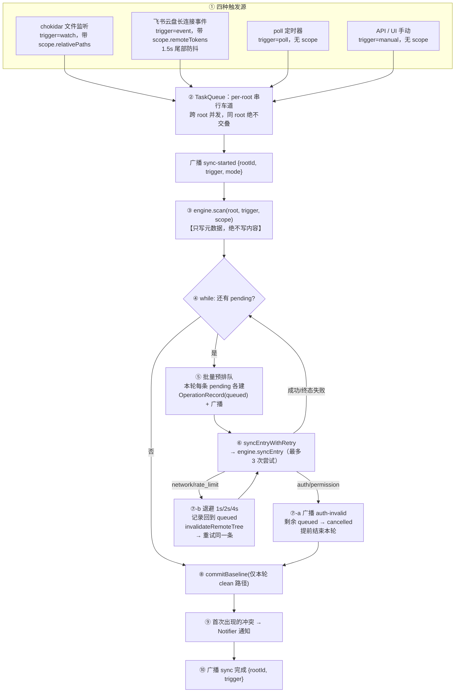
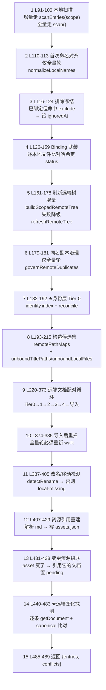
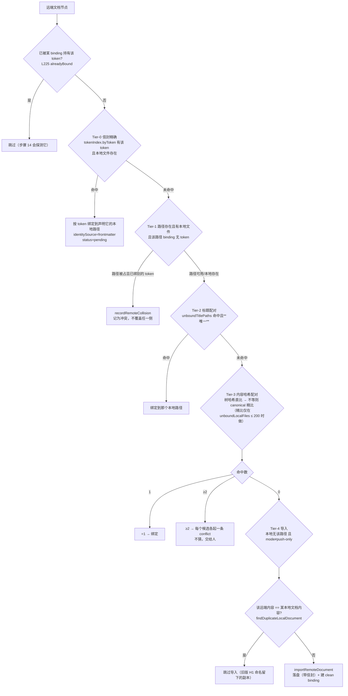
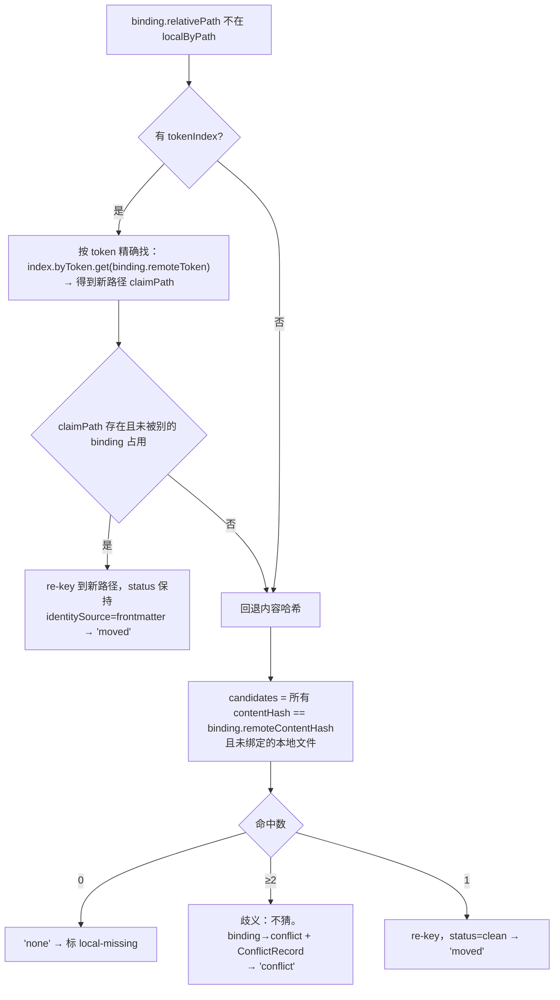
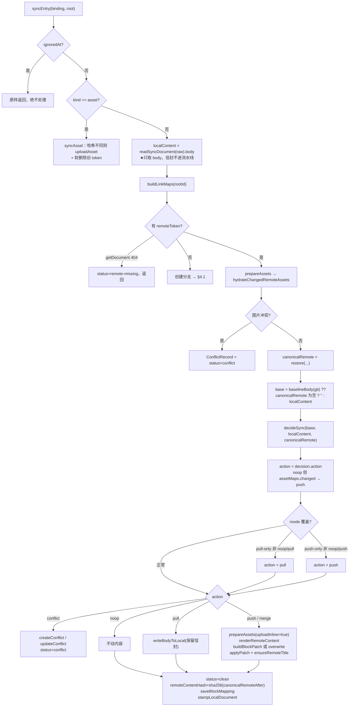
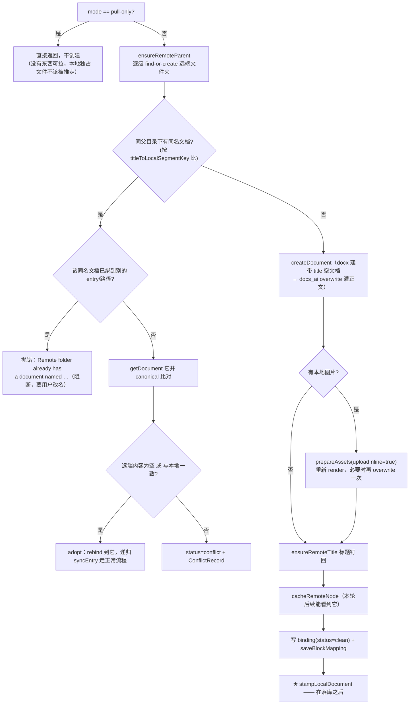
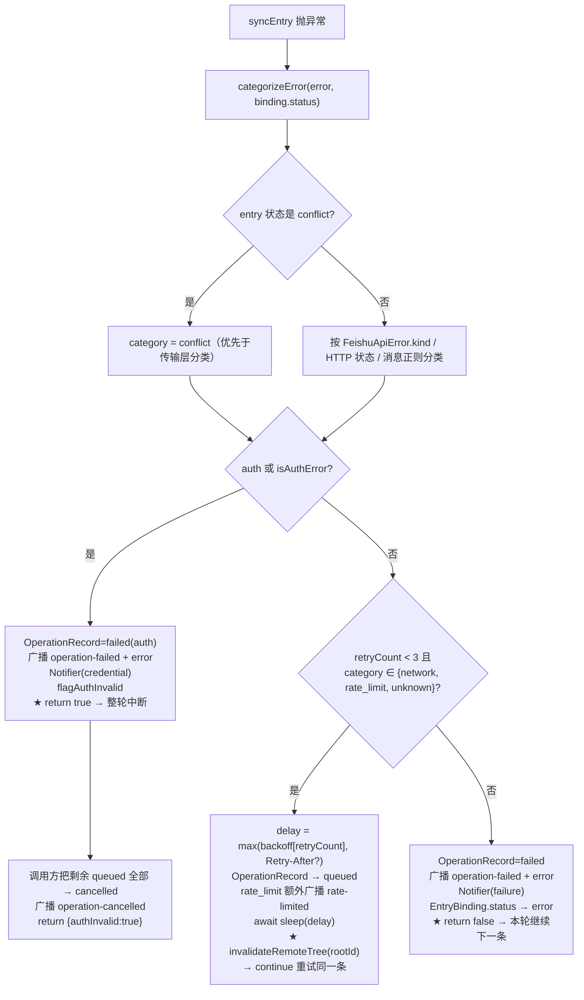
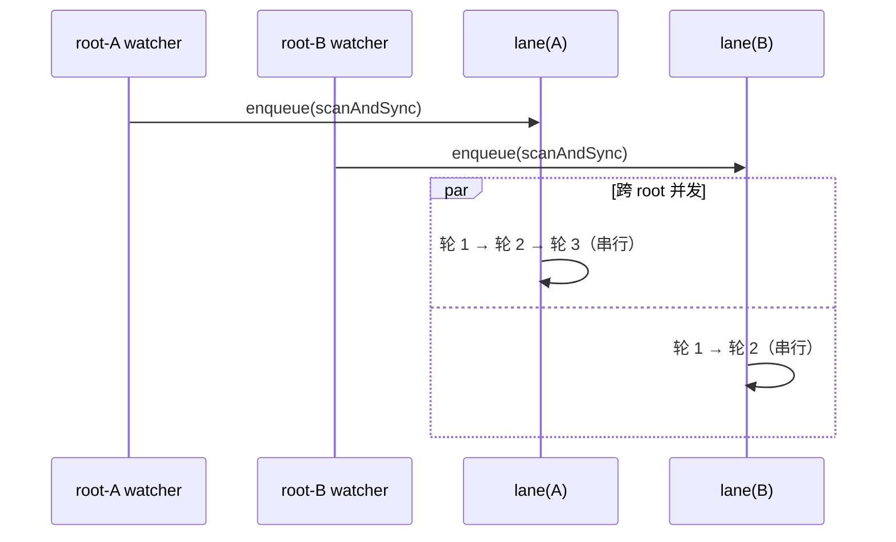

# 03 · 同步机制全流程

> 这是本项目的核心篇。从"有人动了一下"到"飞书和本地再次一致"，中间发生的每一步都在这里。
>
> 主战场两个函数：`packages/core/src/sync.ts` 的 `scan()`（L77-490）与 `syncEntry()`（L535-704），加上编排者 `packages/server/src/runtime.ts` 的 `scanAndSync()`（L677-768）与 `syncEntryWithRetry()`（L778-843）。

---

## 1. 全景图



**为什么扫描和执行要分两个阶段**：扫描回答"现在两边各是什么状态、谁和谁是一对"，它只改 `bindings.json` 里的 status/token；执行回答"这条差异该怎么消解"，它才会读文件、发 HTTP、写盘。分开之后，"配对错了"和"内容写坏了"是两类可以独立诊断的故障，而且扫描阶段发现的级联关系（图片变了要牵连引用它的文档）能在同一次执行循环里被消化掉。

---

## 2. ① 触发与作用域

| 触发 | `trigger` | 携带 `SyncScope` | 扫描形态 |
| --- | --- | --- | --- |
| chokidar add/change/unlink | `watch` | ✅ `relativePaths` | 优先增量，前提不满足自动降级全量 |
| 飞书云盘事件（`drive.file.*`） | `event` | ✅ `remoteTokens` + `remoteParentTokens` | 同上 |
| poll 定时器 | `poll` | ❌ | **总是全量** |
| API/UI 手动 | `manual` | ❌ | **总是全量** |

```ts
// sync.ts:86 —— 增量生效的严格条件
const incremental = (trigger === 'event' || trigger === 'watch')
                 && Boolean(scopedPaths || scopedTokens);
```

**只有 event/watch 且真的带了作用域才叫增量**。poll/manual 无条件全量——这是"正确性优先于速度"的直接体现：定时器拿不到"什么变了"的信息，只能全量重算。

作用域判定用一个闭包谓词贯穿整个 scan：

```ts
// sync.ts:87
const inScope = (relativePath, remoteToken?) =>
  !incremental
  || (scopedPaths?.has(relativePath) ?? false)
  || (remoteToken !== undefined && (scopedTokens?.has(remoteToken) ?? false));
```

后面每个循环开头都有 `if (!inScope(...)) continue;`。**不在作用域内的条目这一轮被完整地跳过，既不探测也不改状态**——这是增量轮不会产生误判的根本保证，也是它能省掉 N 次 `getDocument` 的原因。

### 事件通道的防抖

`eventchannel.ts` 用 1.5 秒**尾部防抖**：一次批量编辑会连发几十个事件，全部合并成一轮同步。同时用 `generation` 计数丢弃旧客户端的事件（凭证变更后重建连接，旧连接的迟到事件不能污染新一轮）。事件只带 token，所以 `remoteParentTokens`（来自 `created_in_folder` 事件）很关键——它让增量轮能用一次单层 `listFolderChildren` 定位新建文档，而不必走全量 DFS。

---

## 3. ③ 扫描阶段：15 个步骤

`scan()` 是一条 400 行的线性流程。逐步拆解（左栏是代码里的实际顺序和行号）：



### 步骤 1 · 本地扫描

`FilesystemProvider.scan()`（`local.ts:11`）递归 walk，过滤规则：跳过 `.` 开头的隐藏段（**但 `..` 故意放行**，让它撞上 `safePath()` 抛错而不是被静默忽略）、跳过 `node_modules`、跳过 `exclude` glob 命中的、只收 `.md` 和 7 种图片扩展名。

产出 `LocalFile`，其中 `.md` 的 `contentHash` 是 **`sha256(body)`**（信封已剥），`rawHash` 才是整文件哈希。这一步是身份机制不破坏同步的关键，详见 [04 篇 §3](04-special-mechanisms.md)。

增量快路径 `scanEntries(root, paths)`：只 stat+hash 列出的路径，目录参数会递归展开，**消失的路径直接跳过**（删除要靠后面的 binding 循环识别成 `local-missing`，不能在这里报错），**逃逸出 root 的路径照样抛错**（让引擎降级全量）。

### 步骤 2 · 首次命名对齐（`LocalNameAligner`）

飞书会把云盘文档名推导自 Markdown 的首个 H1。为了让"文件名 == H1 == 远端名"这个等式从一开始就成立（否则后面每次配对都要走模糊层级），扫描会把**从未绑定过**的本地文档改名成它的 H1。

四个"绝不动"的条件（`name_align.ts:39-55`）：

- 已有 binding 的（对齐恰好每文档只发生一次）；
- 内容哈希与**任何已绑定条目**相同的（这是移动/副本候选，归改名检测和同名治理管，改名会打架）；
- 没有 H1 的、或者基名归一化后已经等于 H1 的；
- 目标路径已被占用或落在 `takenPaths` 里的（**绝不覆盖兄弟文件**）。

改名后还会级联改写所有指向旧路径的 Markdown/wiki 链接（按 `normalizeForMatch(resolvedPath)` 匹配，所以 `./a.md`、`a.md`、大小写变体都能命中；锚点和 query 后缀保留）。**纯大小写改名在大小写不敏感文件系统上必须走临时文件中转**（`renameFile` 的 `caseOnly` 分支）——直接"写新路径再删旧路径"会因为两者指向同一物理文件而把刚写入的内容删掉。

> ⚠️ 只在**全量轮**跑。注释说得很明白：增量轮的作用域是按旧路径 key 的，改名会让作用域失效；一个这一轮没被规范化的新文件，下一轮 poll 会补上。稳定压倒及时。

### 步骤 3 · 排除冻结

已经被绑定、但现在落进 `exclude` 里的路径 → 打上 `ignoredAt` 时间戳。**不是删除绑定，也不是标 local-missing**：`local.scan` 已经跳过它了，如果不当冻结处理就会被误判成"本地文件消失"。此后所有循环都以 `if (binding.ignoredAt) continue;` 开头，用户取消 exclude 之前这条记录是完全静止的。

### 步骤 4 · Binding 武装（决定 status 的核心逻辑）

```ts
// sync.ts:133-142
const changed = existing?.remoteContentHash !== file.contentHash;
const status = existing?.status === "conflict"
  ? "conflict"                                    // 冲突必须人裁决，不自动清
  : changed
    ? "pending"                                   // 内容变了，要同步
    : existing?.status ?? "pending";              // 没变 → 保留原状态
```

三条语义：

1. **`conflict` 状态有粘性**——除非用户在工作台处理，扫描绝不把它改回 pending/clean。
2. **`error` 状态跨轮保持**（注释在 L134-137）。之前"内容没变就重新武装 pending"导致一个永久失败的条目每 15 秒被重试一次，任务中心刷屏，且完全没有推进。**现在 `error` 只有一条出路：内容真的变了，或者用户在任务中心点「重试」。**
3. 全新文件 `existing` 是 `undefined` → `pending`。

### 步骤 5-6 · 远端树与同名治理

- 全量轮：`refreshRemoteTree()` 强制刷新缓存并 DFS 走完整目录。
- 增量轮：`buildScopedRemoteTree()` 只读公告 token——已绑定的 token 直接 `getDocument`；未绑定的 token 在公告的父目录里 `listFolderChildren` 找。**任一 token 找不到或网络异常就返回 `undefined`，调用方立刻降级全量**（`remote_tree.ts:65-104`）。
- `governRemoteDuplicates` **只在全量轮**跑，因为它是"按父目录分组找同名"的判定，树不完整就会误删。详见 [04 篇 §6](04-special-mechanisms.md)。

### 步骤 7 · ★ 身份层（Tier-0）

```ts
const tokenIndex = await this.identity.index(root, files);   // 读所有信封，建索引
await this.identity.reconcile(root, tokenIndex, remoteTree); // 按仲裁矩阵修 bindings
// 修完必须重新读一遍 bindings：后面的配对循环依赖已一致的 path→token 集
initialBindings = await this.metaStorage.listBindings(root.id);
existingByPath  = new Map(initialBindings.map(b => [b.relativePath, b]));
```

这是整个身份机制的入口。`index()` 产出六个桶（`byToken`/`claims`/`foreign`/`missing`/`malformed`/`tokens`），`reconcile()` 按固定顺序执行：R2 多声明先行 → 矩阵 #2 回填 → 逐条走 #1/#3/#4/#5/#5′。完整矩阵见 [04 篇 §2](04-special-mechanisms.md)。

### 步骤 8 · 构造候选集

- `buildRemotePathMaps()` 把远端树投影成 `token → 本地路径` 三张表（documents / assets / assetParents）。**不同的远端标题净化成同一个本地路径时要消歧**（`a/b` 和 `a-b` 都变 `a-b`），给后来者在最后一段追加 `-2`；**完全相同的标题不消歧**——那是真副本，交给同名治理折叠到一个路径上（`remote_tree.ts:113-121`）。
- `unboundTitlePaths`（按归一化基名分桶）和 `unboundLocalFiles`（平铺）——**只有"没有信封、没有绑定、没被忽略"的本地文档才会进这两个候选池**。`tokenIndex.tokens.has(path) || tokenIndex.foreign.has(path)` 的一律 `continue`（这就是铁律 R1 的代码形态：被信封声明的文件不参与任何启发式配对，别的文档不能把它偷走）。

### 步骤 9 · 五级配对（最重要的一段）

对远端树里每个 `type === "document"` 的节点依次尝试，命中即停：



**四级的分工**：

| Tier | 依据 | 强度 | 主要解决 |
| --- | --- | --- | --- |
| 0 | 信封 `feishu_token` | **权威** | 改名、移动、`.feishu-sync` 丢失后的精确重连 |
| 1 | 远端路径 == `binding.relativePath` | 强 | 首次接触、或元数据重建后按目录结构对齐 |
| 2 | 标题（NFC 归一 + sanitize 后）且**必须唯一** | 中 | 远端标题=本地文件名但路径不同（用户挪了目录） |
| 3 | 内容哈希且**必须唯一** | 弱 | 存量文档：远端标题是 H1、本地文件名是别的 |
| 4 | 导入 | — | 真的只有远端有 |

多命中一律**升级成 conflict 而不是猜**。Tier-3 里那句 `unboundLocalFiles.length <= 200` 是对精比成本的约束——精比要对每个候选做一次 canonical 化，500 篇的 root 上会失控。

### 步骤 10 · 导入后重扫

导入会造出新的本地文件，必须重扫才能让后面的循环看到它们。**但全量轮必须重新完整 walk，不能用 `scanEntries` 快路径**：

```ts
// sync.ts:375-383
const rescanPaths = incremental ? [...(scopedPaths ?? []), ...importedPaths] : [];
files = this.local.scanEntries && rescanPaths.length > 0
  ? await this.local.scanEntries(root, rescanPaths)
  : await this.local.scan(root);   // ← 全量轮走这里
```

`scanEntries` 只返回**列出的**路径。全量轮若走它，其它所有已绑定文件在 `localByPath` 里"消失"，步骤 11 就会把它们集体误判成 `local-missing`。这是本项目实现过程中修掉的一个真实历史 bug，测试 `identity.test.ts` 里「an entire directory move keeps every document on its token」这条就是它的守卫。

### 步骤 11 · 改名/移动检测

对"有 remoteToken 但本地路径不见了"的 binding：



按 token 找是**精确**的，不要求内容一致——用户改完名又顺手编辑了几个字，旧的内容哈希匹配就失效了，而 token 照样能认出来。

### 步骤 12-13 · 资源引用与级联

解析每个文档 body 里的图片引用，写 `assets.json`：`图片路径 → [引用它的 document entryId]`。然后对内容变了的 asset，把引用它的文档全部 re-arm 成 `pending`（`conflict` 状态的除外）。

**为什么需要级联**：图片是独立的 `asset` 条目，文档 body 里只有相对路径。图片文件换了、文档一个字节没改，`contentHash` 不变，不级联就永远推不上去。

排序上也有配套：`scanAndSync` 里 pending 列表 `.sort((l, r) => Number(l.kind !== "asset") - Number(r.kind !== "asset"))`，**asset 永远排在 document 前面执行**，这样同一轮里图片先传完、文档再引用它。

### 步骤 14 · ★ 远端变化探测

扫描里最贵的一段（每条一个 `getDocument`），也是判断"远端动过了"的唯一依据：

```ts
// sync.ts:464-466
const canonicalRemote = restoreAssetReferences(
  restoreInternalLinks(remote.content, reverseMap, binding.relativePath),
  assetReverseMap, binding.relativePath);
const remoteHash  = sha256(canonicalRemote);
const remoteChanged = binding.remoteContentHash !== undefined && remoteHash !== binding.remoteContentHash;
```

**必须 canonical 化后再比**。远端 markdown 里存的是 `<cite type="doc" doc-id="tokXXX"/>` 和 ``，本地存的是相对路径；不还原就直接比，两侧永远不等，每一轮都会误判成"远端变了"并触发一次 pull——这就是自激同步的头号来源。

如果条目处于 conflict，还要检查冲突记录是否过期，过期就把三方向内容刷新到记录里（L471-473），让工作台看到的永远是最新三份。

---

## 4. ⑥ 单条执行 `syncEntry`



### 4.1 创建分支（无 token 或远端 404）



三个必须理解的细节：

1. **同路径豁免**（L574-580）：同名文档的 binding 如果就挂在**同一个 relativePath** 上，那是本条目自己上一轮没写完的记录（元数据重建后 `entryId` 会变），不能当外来副本阻断，否则元数据丢失后第一次重绑就永久失败。
2. **空文档认领**（L587）：一个同名但 content 为空的远端文档，几乎必然是"createDocument 成功了、写正文前崩了"的半成品。认领它并补内容，而不是抛冲突，也不是再建一个。
3. **`stampLocalDocument` 在 `setBinding` 之后**（L625→L629）。反过来（先打标后落库）一旦中间崩溃，磁盘上就有一个带着远端 token 的本地文件而 DB 一无所知——虽然矩阵 #5′ 也能处理，但"落库成功"是更强的事实。顺序定成"落库 → 打标"后，崩溃窗口由矩阵 #2 的回填自愈。

### 4.2 `base` 的一个关键兜底

```ts
// sync.ts:655
const base = baselineContent ?? (canonicalRemote.trim() === "" ? "" : localContent);
```

git 基线不存在时（首次绑定该文件），**如果远端文档是空的**就把 base 定为 `""`，让三方判定退化成"本地变了 → push"。若定成 `localContent`，则 `base == local` 而 `remote != base`，判定成 **pull**，一个空文档就会把用户本地内容整篇抹掉。这个分支专门防的就是"标题配对认领了一个空壳文档"的场景。

---

## 5. 三方合并 `decideSync`

`merge.ts:52`，8 行，纯函数：

```ts
export function decideSync(base, local, remote): SyncDecision {
  if (local === remote) return { action: "noop",     reason: "..." };
  if (local === base)   return { action: "pull",    reason: "only remote changed" };
  if (remote === base)  return { action: "push",     reason: "only local changed" };
  const merged = mergeBlocks(parse(base).blocks, parse(local).blocks, parse(remote).blocks);
  if (merged.conflict || merged.content === undefined)
    return { action: "conflict", reason: "both sides changed the same Markdown block" };
  return { action: "merge", reason: "...", mergedContent: merged.content };
}
```

判定表：

| base vs local | base vs remote | action |
| --- | --- | --- |
| local == remote | （任意） | `noop` |
| local == base | remote ≠ base | `pull` |
| remote == base | local ≠ base | `push` |
| 双方都变，变的 block **不重叠** | | `merge` |
| 双方都变，变的 block **重叠且文本无法合并** | | `conflict` |

`mergeBlocks` 有两层：

- **block 层**（`merge.ts:9-45`）：按下标对齐三方的 block 序列，逐位判断"这位置谁变了"。只有一边变 → 取变的那边；两边都变但结果相同 → 取任一；两边都变且不同 → 下沉到文本层。
- **文本层**（`mergeText`，L125-135）：block 内部再用 `changedRange` 求"从 base 到 X 的最小行区间改动"。**两个区间不重叠就能合并**（`applyTwoChanges` 按位置依次套用），重叠就 `conflict`。

`buildBlockPatch`（L61）决定推送用块级还是整篇 overwrite：`base` 的 block 数必须与**远端实际 block 数**相等且 kind 逐位一致，才允许生成块级操作；数量不等还会试"恰好增/删了一个 block"的简单结构补丁；再不行退化成 `overwrite`。这个退化会**悄悄丢掉块级并发保护**（别人的评论锚点、别人的并发编辑），是已知中高优先级缺陷（B3）。

---

## 6. ⑦ 失败与重试



四层"次数"是**互相独立**的，很容易看混：

| 层 | 上限 | 语义 |
| --- | --- | --- |
| `scanAndSync` 外层 while 的 `attempts` Map | 每条 entryId 每轮最多 3 次 | 防级联 re-arm 造成无限循环（asset 同步完把文档置 pending，文档同步完又把引用者置 pending…） |
| `OperationRecord.maxRetries` | 3 | **持久化在记录上**，任务中心显示"第 N 次尝试" |
| `syncEntryWithRetry` 内 `retryCount` | 3 | 真正控制退避循环的计数器 |
| 跨轮 | **0**（不自动重试） | `status=error` 一路保持到人工重试或内容变化 |

三个容易忽略的设计：

- **`Retry-After` 是下限不是精确值**：`Math.max(scheduled, retryAfterMs)`。飞书给 120s 你就不能 1s 后重试；飞书给 0.5s 你也不该比重试策略更快。
- **重试前必须 `invalidateRemoteTree`**（L828）：上一轮"API 报错但文档其实建成了"的情况，如果继续用缓存的树，同名守卫看不到它，就会再建一个副本。
- **auth 中断要取消剩余 queued**：本轮已经批量预排队了 N 条，中断时若不把它们改成 `cancelled`，任务中心会永远挂着 N 条"排队中"的幽灵。

---

## 8. ⑧ 基线提交

```ts
// runtime.ts:745
const cleanPaths = new Set(finalBindings
  .filter(b => b.status === "clean" && !b.ignoredAt)
  .map(b => b.relativePath));
await this.gitStorage.commitBaseline(root.id, `sync: ${trigger}`, trigger, cleanPaths);
```

**只提交本轮达到 clean 的路径**。原因（注释在 L738-744）：把冲突/失败/缺失/被忽略条目的工作树内容一起提交，下一轮就会看到 `base === local`，于是三方判定从"检出分歧"退化成"远端单方变了 → pull"，**把用户没同步成功的本地编辑拉平掉**。这是最隐蔽的一类数据丢失，所以基线范围必须精确到条目。

三个 `commitBaseline` 调用点：

| 调用点 | `onlyPaths` | 提交信息 |
| --- | --- | --- |
| `scanAndSync` 末尾 | 本轮全部 clean 条目 | `sync: {trigger}` |
| `syncSingleEntryAndCommit`（单条重同步、冲突解决后） | 单条路径 | `sync: single-entry` / `resolve: conflict` |
| — | — | 消息最终形态 `"... [trigger=watch]"`，作者 `Feishu Sync <sync@feishu.local>`，`parseTrigger` 反解它 |

> ⚠️ **基线就是 `refs/heads/main`**，用户自己在仓库里 commit / rebase / checkout 会直接改变 base，从而改变同步判定（可能把远端内容"拉平"本地编辑，或反之）。这是"用 git 当存储"的固有代价，目前无防护，见 [07 篇 §5](07-known-issues.md)。

---

## 9. ⑩ 广播与回声抑制

一轮同步对外可见的信号全走 WebSocket（`runtime.broadcast`），前端每条消息都触发一次 `refresh()`。事件清单见 [06 篇 §2](06-api-and-ui-reference.md)。

**回声（echo）是自激同步的第二来源**（第一来源是"信封进了哈希"，见 [04 篇 §3](04-special-mechanisms.md)）：

```
pull 写本地文件 → chokidar change 事件 → 又一轮同步 → 又写文件 → …
push 写远端文档 → 飞书云盘事件回来    → 又一轮同步 → 又拉又推 → …
```

`EchoGuard`（52 行，TTL 5 秒）用两个 `key → 过期时间戳` 的 Map 掐断它：

```ts
// runtime.ts:792-794（成功之后登记）
if (binding.kind === "document") this.registerLocalWrite(root, binding.relativePath);
else if (direction === "pull")   this.registerLocalWrite(root, binding.relativePath);
if ((direction === "push" || direction === "merge") && after?.remoteToken)
  this.registerRemotePush(after.remoteToken);
```

**注意 document 是无条件登记本地写**：任何一轮成功的 sync 都可能刚刚给这个文件打了标（push/merge 分支末尾都有 `stampLocalDocument`），这个写盘不是用户编辑，必须被吞掉。

watcher 端消费：chokidar 的 add/change 回调先查 `isRecentLocalWrite(absolutePath)`，命中就丢。事件通道端查 `isRecentRemotePush(token)`。

**5 秒是经验值，也是这个机制的边界**：如果一次同步的写盘到事件回来的间隔超过 5 秒（大文件、慢网络、飞书事件延迟抖动），回声就会漏过去，触发一轮"多余但无害"的同步——下一轮 `decideSync` 判定 `noop`，不会造成内容破坏，但会白烧一次 `getDocument`。这是"宁可多跑一轮也不漏掉真编辑"的取舍。

---

## 10. 并发模型



- **跨 root 并发、同 root 串行**：一条 Promise 链就是一个车道。同 root 两轮交叠会同时读写同一个 `bindings.json`，后果是绑定丢失或重复建文档。
- **`enqueue` 与 `enqueueResult` 两条入口共用同一份 lane map**：前者 fire-and-forget（watcher/poll），异常在链上被 `onError` 吞掉；后者给需要返回值的 API 路由用，把结果/异常交给调用方，但**存进 map 的仍是已 catch 的链**。差别只在"错误给谁看"，不变的是"车道不能被 poison"。
- 远端树缓存有 `jobs` Map 做 **single-flight**：同一 TTL 窗口内的并发 `listTree` 只发一次请求。
- ⚠️ **同一个进程内的多条 lane 是唯一的一层**——**没有跨进程单实例锁**。开两个服务实例指向同一个 root，就是两个进程在交替改同一个 `bindings.json` 和同一个 `.git`。已知缺口，见 [07 篇 §6](07-known-issues.md)。
