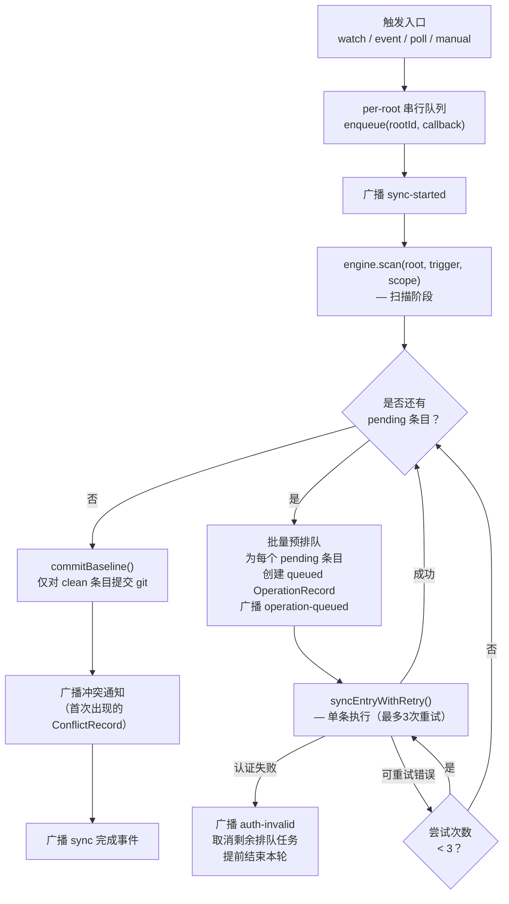
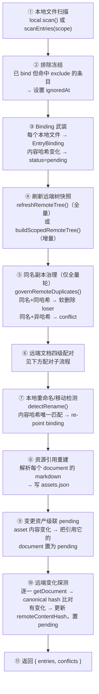
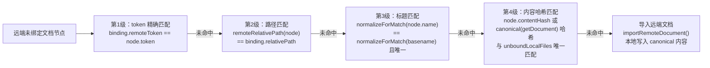
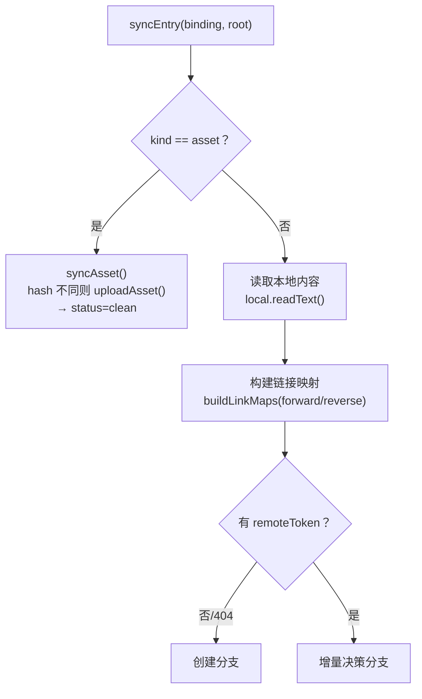
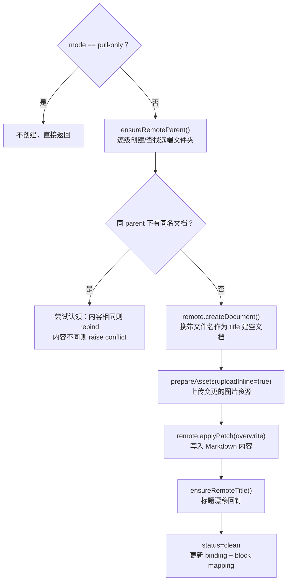
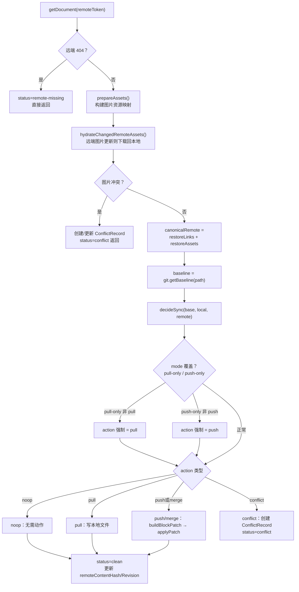
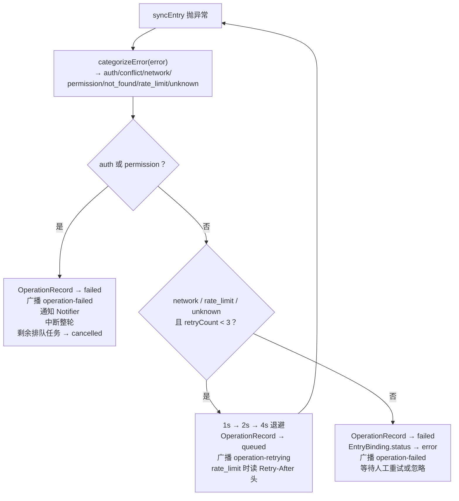

# 单次同步流程详解

本文以 `SyncRuntime.scanAndSync()` 为入口，完整讲解一轮同步从触发到结束的全过程。

---

## 1. 触发来源

四种来源均可触发一轮同步，最终都汇入 `scanAndSync(root, trigger, scope?)`：

| 触发方式 | `trigger` 值 | 说明 |
|---|---|---|
| chokidar 文件监听 | `watch` | 本地 add/change/unlink 事件；携带 `scope.relativePaths` |
| 飞书云盘长连接事件 | `event` | SDK WebSocket 订阅；携带 `scope.remoteTokens` |
| 定时器轮询（pollIntervalMs） | `poll` | 无 scope，始终走全量扫描 |
| API / UI 手动点击 | `manual` | 无 scope，始终走全量扫描 |

> **增量快路径**：`watch` 和 `event` 可携带 `SyncScope`，`scan()` 只对 scope 内的路径/token 做局部探测；任一前提不满足则自动降级为全量扫描（正确性优先）。

---

## 2. 整体流程大图



---

## 3. 扫描阶段（scan）详解

`scan()` 负责构建/更新所有 `EntryBinding` 并探测两侧的改动，它**不直接写入任何内容**，只更新元数据状态。



### 3.1 四级配对子流程

扫描阶段对每个**未绑定的远端文档节点**执行以下递进配对，命中任意一级即停止：



> **重复导入防护**：若远端文档的 canonical 内容与任意本地文档相同但名字不同，引擎跳过导入，避免为旧版按 H1 命名的重复副本创建新本地文件。

---

## 4. 单条执行阶段（syncEntry）详解

`scanAndSync()` 的 while 循环里，对每个 `status=pending` 的条目调用 `engine.syncEntry(binding, root)`：



### 4.1 创建分支（无 remoteToken 或远端已 404）



### 4.2 增量决策分支（有 remoteToken）



---

## 5. 三方合并决策（decideSync）

`decideSync(base, local, remote)` 是纯函数，基于三方向内容（Block 粒度）做判断：

| base vs local | base vs remote | 结论 |
|---|---|---|
| local == remote | — | `noop` |
| local == base | remote ≠ base | `pull`（远端单方变化） |
| remote == base | local ≠ base | `push`（本地单方变化） |
| 双方都变，但变更 Block 不重叠 | — | `merge`（自动合并） |
| 双方都变，且变更同一 Block | — | `conflict`（人工裁决） |

合并粒度为 Markdown Block（段落/标题/代码块等），Block 内文本用行级 changedRange 做二次合并。

---

## 6. 失败与重试策略



- `auth`/`permission`/`not_found`/`conflict` 快速失败，**不跨轮自动重试**；
- `network`/`rate_limit`/`unknown` 单轮内最多重试 3 次，超过后 entry 置 error；
- entry 的 `status=error` 跨轮保持，直到内容变化或用户在任务中心点「重试」。

---

## 7. 操作记录生命周期

每个 `pending` 条目在 `scanAndSync()` 的 while 循环**开始时**就批量预创建 `OperationRecord(status=queued)`，执行时转为 `running`，结束时转为终态：

```
queued  ──►  running  ──►  succeeded
                         ──►  failed     （auth/permission/超过重试）
            queued（自环，退避重试）
                         ──►  cancelled  （auth 中断整轮，取消剩余条目）
```

`scanAndSync()` 结束后，只对本轮达到 `status=clean` 的条目执行 `commitBaseline()`，将工作树提交为新的 git 基线，作为下轮三方合并的 base。

---

## 8. 关键设计决策

| 设计点 | 决策 | 原因 |
|---|---|---|
| 远端树缓存 | 每 root 60s TTL；retry 时 invalidate | 避免同轮多次 listTree，同时防止写入后缓存陈旧导致重复建文档 |
| 文件夹绑定持久化 | `folders.json` 缓存 token | 重启后不重复创建远端文件夹 |
| 标题钉回 | 每次内容写入后检查并 renameDocument | docs_ai 的 Markdown 导入会用 H1 重写标题，需保证「云端名=本地文件名」恒成立 |
| Echo 防护 | recentLocalWrites + recentRemotePushes (5s TTL) | 防止 pull 写入本地触发 watcher、push 写入远端触发 event 形成同步死循环 |
| 同路径豁免 | 同 entryId 或同 relativePath 的已有 binding 不视为 external duplicate | 防止元数据重建后自家文档自撞报 "already has a document named..." |
